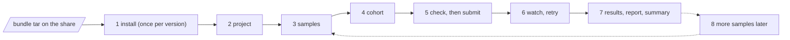

# Quick start

From a bundle on the share to the first cohort's result pages, in
standalone mode, on the HPC. Each step says what to type, what to expect
and which chapter has the details. Nothing here needs the network: the
bundle carries the engine, every container and the reference data.



Text version: install the bundle once, create a project, register the
samples, freeze a cohort, check what SLURM will be asked for, submit under
`tmux`, watch and retry, read the results; samples that arrive later are
registered into the same project and a new cohort is frozen.

## Before you start

- A login node with SLURM (`sbatch`, `squeue`) and `apptainer` on `PATH`,
  also on the compute nodes; a partition and account for the jobs
  (`sinfo -o "%P %c %m %G"` shows the node shapes, chapter 12).
- A `python3` of the version the bundle was built for. The installer prints
  both and refuses a mismatch; on the smoke cluster it is
  `module load python/3.12.7`.
- The bundle directory: `ugc-pacbio-wgw-0.3.0.tar`, its `.sha256`,
  `install-bundle.sh`, and a `site.cfg` to start from
  (`examples/site.cfg` in this guide).
- Three writable places on a filesystem the compute nodes read: the install
  prefix (`/proj/ugc` below), a results root, and the raw HiFi BAMs.
- The sample list: a sample sheet (chapter 05) or the facility's per-file
  delivery manifest.

## 1. Install the bundle

```bash
module load python/3.12.7
cd /path/to/share
sha256sum -c ugc-pacbio-wgw-0.3.0.tar.sha256
./install-bundle.sh --bundle ugc-pacbio-wgw-0.3.0.tar --prefix /proj/ugc --verify-only
```

Verify-only unpacks into a staging directory, checks every file against the
bundle manifest, builds a throwaway virtual environment, runs
`miniwdl check` on every workflow and removes everything again. It ends
with `verify-only passed for ugc-pacbio-wgw-0.3.0`; a Python mismatch or a
corrupt tar stops here, before anything is installed.

Then write the site file. Copy `examples/site.cfg` and set the partition
and account, the node shape (`TASK_CPU_MAX`, `TASK_MEMORY_MAX`, so that no
task asks for more than a node has) and, if the cluster has GPUs you mean
to use, `SLURM_PARTITION_GPU` and `SINGULARITY_NV=1` (chapter 04 lists
every key). Install and activate:

```bash
./install-bundle.sh --bundle ugc-pacbio-wgw-0.3.0.tar --prefix /proj/ugc \
    --references /proj/ugc/references --site site.cfg --activate
export PATH=/proj/ugc/current/code/bin:$PATH      # put this in your profile
```

This takes a few minutes: the reference data (3.2 GB) is copied out of its
container once per references directory and verified against the recorded md5s.
The last lines of the output are the paths the driver needs; keep the `ref_map=`
line and the `# next: ... ugc-wgw init ...` line. `ugc-wgw --help` now works.

## 2. Create a project

A project is a directory with a `.ugc-wgw/` state database; one per campaign.
The results root may be elsewhere:

```bash
ugc-wgw init /proj/ugc/projects/cohort2026 --install /proj/ugc/current \
    --ref-map /proj/ugc/current/references/ugc_wgw_ref_map.GRCh38_GIABv3.tsv \
    --results /proj/ugc/results/cohort2026
cd /proj/ugc/projects/cohort2026
```

The project stays on the version it was created with, even after another
bundle is activated later (chapter 10). Two flags worth knowing now:
`--max-inflight N` sets how many samples run at once by default, and
`--deepvariant gpu --gpu-type a100` selects GPU DeepVariant if the install
was prepared for it (chapter 12). Everything else is a key in
`.ugc-wgw/config.json` (chapter 05).

## 3. Register the samples

The sample sheet is tab-separated: `sample_id`, `hifi_reads` (BAM paths,
comma-separated), optionally `sex`, `fail_reads`, `father_id`,
`mother_id`, and any other columns as metadata. A facility's per-file
manifest (one row per BAM, PLINK-style pedigree) becomes one with the
converter:

```bash
python3 /proj/ugc/current/code/scripts/manifest-to-samples.py delivery.csv -o samples.tsv
ugc-wgw samples add samples.tsv
ugc-wgw samples list
```

`samples add` checks that every BAM exists (`--no-check` for a sheet
prepared before the data lands), makes the paths absolute and refuses a
sheet with a duplicated or malformed ID. Registering a sample runs nothing.

## 4. Freeze the cohort

```bash
printf 'study_0001\nstudy_0002\nstudy_0003\n' > cohort.txt
ugc-wgw cohort freeze C1 --samples cohort.txt
```

A cohort is an immutable, ordered list of registered samples under an ID;
the cohort stages (merges, frequencies) run over it. A changed membership
is a new cohort ID. In standalone mode the per-sample stage does not need
a cohort at all; freezing it now lets one `submit` carry the campaign to
the end.

## 5. Check what will be asked, then submit

```bash
ugc-wgw resources --changed                            # site caps and policy rows that change a request
ugc-wgw submit --mode standalone --cohort C1 --dry-run # the plan and the first wave, nothing launched
```

The dry run prints the resource summary line, the runnable subjects and
the exact `miniwdl run` command of the first wave. A warning here (a policy
row that matches no task, a GPU flavour without `--nv`) is cheaper than a
refused job. Then, under `tmux` on the login node (or as a long-lived job,
`examples/submit.sbatch`):

```bash
tmux new -s cohort2026
ugc-wgw -v submit --mode standalone --cohort C1 --max-inflight 40 --poll-interval 60
```

`submit` is a foreground loop: it keeps `--max-inflight` samples running,
starts `cohort_merge` when the last `singleton` succeeded and
`cohort_freq` after that, and exits when nothing is runnable. Every sample
is one miniwdl run; every task of it is one SLURM job.

## 6. Watch, retry, stop

With `-v` the terminal shows one line per event and a progress block every
five minutes:

```
progress mode=standalone 12/41 (29%) eta≈6h10m
  singleton     done 12/40  active 2 (HG004 21/33 tasks, HG002ds 9/33 tasks)  median 2h05m  eta≈5h40m
  cohort_merge  done 0/1  waiting 1  median –  eta≈–
```

From another terminal:

```bash
ugc-wgw progress --mode standalone --cohort C1          # the same block
ugc-wgw status --mode standalone --cohort C1 --failed   # failed runs with kind and message
ugc-wgw logs study_0002 --stage singleton --follow      # miniwdl's log of the latest attempt
```

A failed run does not stop the others. Transient failures (a node lost, a
SLURM hiccup) are retried by the driver itself after a backoff; anything
else waits for you:

```bash
ugc-wgw retry --mode standalone --stage singleton               # every failed singleton
ugc-wgw retry --mode standalone --stage singleton --samples study_0002
```

A retry replays every task that already succeeded from the call cache and
redoes only the failed one. Ctrl-C (or `scancel` of the driver's job) stops
cleanly: running tasks are cancelled, their runs marked `cancelled`, and
`retry` picks them up later. Chapter 09 lists the failure kinds and what to
do about each.

## 7. Read the results

Every run leaves one directory: `<results>/samples/<id>/0.3.0/<stage>/`
with `attempt-N/` per attempt and `current` pointing at the latest.
`current/out/` holds one directory per output; for a sample the ones to
start with are the haplotagged BAM, the phased small-variant, SV and
tandem-repeat VCFs, the methylation pileups and `stats_file`, the one-line
QC table (chapter 07 lists all of them). The cohort's merged VCFs are
under `<results>/cohorts/C1/0.3.0/cohort_merge/current/out/`, the allele
frequencies under `cohort_freq`. Two commands give the overview:

```bash
ugc-wgw report --mode standalone --cohort C1 --out /proj/ugc/results/cohort2026/report.html
ugc-wgw summary --cohort C1 --jobs 8
```

The report is a technical summary of the campaign (runs, timings, failures,
provenance); the summary writes one analysis page per sample and one for
the cohort under `<results>/reports/summary/` (coverage, variants, phasing,
repeats, methylation, QC flags). All are single self-contained HTML files:
copy them to a laptop and open them.

## 8. Samples that arrive later

Register them into the same project, freeze a new cohort with everyone,
and submit again. Only the new samples' `singleton` runs do real work; the
cohort stages run again over the new cohort ID, and every earlier sample's
results stay exactly as they were. If the study needs cohort-consistent
per-sample genotypes or multi-sample SV calling instead, chapter 03
explains when joint mode is worth its cost.

## Where to go next

| Question | Chapter |
|---|---|
| What is a stage, a subject, a mode, an attempt? | 02 |
| Standalone or joint mode; assembly | 03 |
| Site file keys, prefix layout, `miniwdl.cfg` | 04 |
| Sample sheet, cohort list, `config.json`, stage inputs | 05 |
| What `submit` does, concurrency, versions | 06 |
| Every output file and the manifest | 07 |
| What each stage runs and costs | 08 |
| Something failed | 09 |
| A new bundle version | 10 |
| Every command and flag | 11 |
| Cores, memory, partitions, GPUs | 12 |
