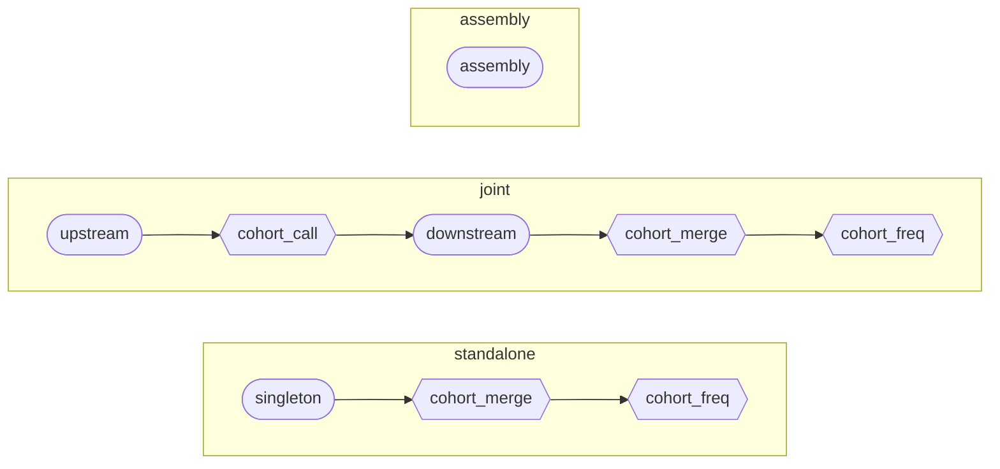

# Overview

## What ugc-pacbio-wgw is

PacBio publishes HiFi-human-WGS-WDL, a WDL pipeline that takes one sample's
HiFi reads to aligned BAM, small variants, structural variants, tandem repeats,
phasing, methylation and pharmacogenomics, with an optional family mode.
ugc-pacbio-wgw wraps that pipeline, unchanged, for a different job: hundreds to
thousands of samples on a SLURM cluster that has no network access at all. It
adds:

- Cohort aggregation. GLnexus joint genotyping, structural-variant merging with
  svx or bcftools, `trgt merge` and trgt-lps, all scattered over genome regions
  so that a 5000-sample cohort runs the same code as a 5-sample one.
- A joint-call-then-phase mode, which is upstream's family semantics at cohort
  scale: genotypes are joint-called across the cohort before each sample is
  phased.
- De novo assembly with hifiasm, trio-binned when the pedigree allows.
- A driver, `ugc-wgw`, that registers samples, freezes cohorts, generates every
  input file, submits runs with a concurrency cap, tracks state in a database
  and writes a provenance manifest per run.
- An offline bundle: code, container images and the workflow engine in one
  tarball, installed and verified on the HPC without downloading anything.

The upstream pipeline is vendored verbatim under `vendor/` and never edited.
Everything ugc-pacbio-wgw adds is in `workflows/ugc*`, `bin/`, `scripts/` and
`backends/`.

## The model in one paragraph

The pipeline is a set of **stages**. Each stage is one WDL workflow invoked once
per **subject**, which is either a sample or a cohort. A **mode** is a named
sequence of stages. The driver decides which subject may run which stage next;
the workflows know nothing about each other. Everything a stage produces lands
under `<results>/<samples|cohorts>/<id>/<v>/<stage>/`.



Rounded nodes run once per sample. Hexagons run once per cohort and start only
when every frozen member has finished the stage before. Text version:

```
standalone:  singleton ──► cohort_merge ──► cohort_freq
joint:       upstream ──► cohort_call ──► downstream ──► cohort_merge ──► cohort_freq
assembly:    assembly                                 (independent)
             per-sample stage    per-cohort stage (waits for every member)
```

| Mode | What you get | Chapter 03 |
|---|---|---|
| `standalone` | Upstream's singleton pipeline per sample, then cohort-level SV, TRGT and LPS files, plus an optional GLnexus cohort VCF. | Default choice. |
| `joint` | Per-sample phased VCFs whose genotypes are consistent across the cohort (including hom-ref at sites variant elsewhere). | Needs a frozen cohort before phasing starts. |
| `assembly` | Haplotype-resolved assemblies, aligned to the reference and called with paftools. | Independent of the other two. |

## What an operator does

1. **Install** a bundle version under `<prefix>` and activate it (chapter 04).
2. **Create a project** and register samples from a sample sheet (chapter 05).
3. **Freeze a cohort**: an immutable, ordered list of sample IDs (chapter 05).
4. **Submit** a mode and leave the driver running under `tmux` or as a SLURM
   job; watch with `ugc-wgw status`, read logs with `ugc-wgw logs` (chapter 06).
5. **Retry** what failed, once the cause is fixed; then hand results and
   manifests to the analysts (chapters 06, 07, 09).

## What is not automated

The driver classifies every failure and re-attempts only the transient ones
(a dead driver, a signal, a node failure) after a backoff; resource, input
and tool failures block their subject until you have fixed the cause and run
`ugc-wgw retry`. It records SLURM job IDs and cancels orphaned jobs, follows a
run's log, removes samples, and refuses to run beside a live driver on
another host. One project is driven by one `ugc-wgw submit` at a time. What a
task asks SLURM for is the WDL's own request, capped by the site and
overridden per task by a policy file the operator keeps (chapter 12);
nothing sizes requests from measured usage yet. Manifests do not yet map
images to tasks.
