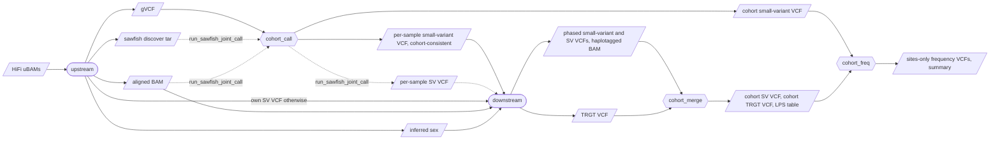

# Concepts

## Stage and subject

A **stage** is one WDL workflow under `workflows/ugc_wgw_<stage>.wdl`, run by
miniwdl as one process that submits its tasks as SLURM jobs. A stage is invoked
once per **subject**. Sample stages take one sample's files; cohort stages take
arrays of files from every member of a cohort.

| Stage | Subject | What it wraps |
|---|---|---|
| `singleton` | sample | Upstream `singleton.wdl`, mirrored call for call: alignment through phasing, TRGT, methylation, PGx, QC. |
| `upstream` | sample | Upstream's pre-phasing half: pbmm2, mosdepth with sex inference, DeepVariant, sawfish discover (and call), Paraphase, mitorsaw, kivvi. |
| `cohort_call` | cohort | GLnexus over the cohort's gVCFs, scattered by region; per-sample split; optional multi-sample sawfish call. |
| `downstream` | sample | Upstream's post-phasing half: HiPhase, TRGT, pbjam and variant stats, MethBat methylation, StarPhase. |
| `cohort_merge` | cohort | svx or bcftools SV merge, `trgt merge` and trgt-lps, optional phased small-variant merge, optional GLnexus. |
| `cohort_freq` | cohort | Allele counts and frequencies of the cohort's joint small-variant VCF and merged SV VCF, overall and per sex, as sites-only VCFs with a summary. |
| `assembly` | sample | hifiasm (trio-binned when both parents are registered), gfatools, minimap2 and paftools per haplotype. |

Stages never call each other. The driver passes outputs of one stage as inputs
of the next, by reading the earlier run's `outputs.json`.

## Mode

A **mode** is the stage sequence the driver walks: `standalone` is
`singleton → cohort_merge → cohort_freq`, `joint` is
`upstream → cohort_call → downstream → cohort_merge → cohort_freq`, `assembly`
is the single stage `assembly`. Every `submit`, `retry`, `status` and `inputs` command takes
`--mode`, default `standalone`, because the same stage can sit in different
modes with different wiring: `downstream` in joint mode takes the cohort-called
VCF, `cohort_merge` in standalone mode takes files from `singleton` runs.

## Version

The ugc-pacbio-wgw version is the content of `VERSION` in the installed code,
for example `0.1.0`. It is part of every results path and every manifest, and
it gates the driver: a stage counts as done for a subject only if it succeeded
**at the current version**. Installing a new version therefore starts every
subject from the first stage again unless you pass `--any-version`, which lets
an older success satisfy a prerequisite and records which version produced it.
Chapter 10 covers the upgrade paths.

## Attempt and `current`

Every launch of a stage for a subject is an **attempt** with its own directory,
`attempt-1`, `attempt-2`, and so on, because miniwdl refuses to finish in a
directory that already holds an `out/`. When an attempt finishes with any
status, the symlink `current` in the stage directory is repointed to it. So
`current` is the latest finished attempt, not necessarily a successful one;
`ugc-wgw status` tells you which. Finished attempts are never modified or
deleted by the driver.

```
<results>/samples/<sample_id>/<v>/<stage>/
├── attempt-1/
├── attempt-2/
└── current -> attempt-2
```

## The two manifests

Each stage writes `<subject>.<stage>.ugc_wgw_manifest.json` as one of its
outputs: the workflow's own statement of what it was (stage, subject, version,
upstream workflow name and version, member IDs, time and host). When the attempt
finishes, the driver writes `run_manifest.json` in the attempt directory: the
run's status, attempt number, exit code, timestamps, the exact upstream commit,
reference data and container digests from the lockfiles, the sha256 of the
inputs file, and the embedded workflow manifest.
`<stage>/current/run_manifest.json` is the canonical provenance record of a
subject and stage. Chapter 07 lists every field.

## Frozen cohort

A **cohort** is an ordered list of sample IDs frozen under a cohort ID with
`ugc-wgw cohort freeze`. It is immutable: the same ID cannot be frozen twice,
and registering more samples later does not change it. The order is significant.
It fixes the order of every array input of the cohort stages and the index by
which per-sample outputs of `cohort_call` are sliced for `downstream`. A
checksum of the list is stored with the cohort. To change membership, freeze a
new cohort ID.

## Reported and inferred sex

The sample sheet's `sex` column never reaches the workflows: upstream infers
the karyotype from chromosome coverage in `upstream` (or inside `singleton`),
and the **inferred** sex is what drives sawfish and TRGT and what the driver
passes as the required `sex` input of `downstream`. An inferred value can be
the empty string; the driver preserves it. The sheet's column is used once,
by `cohort_freq`, to put a member into the XX or XY stratum ahead of the
inferred value (chapter 08).

## The call cache

miniwdl caches every completed task by the digest of its inputs and command
under `<prefix>/call_cache`, shared by all installed versions. A retry of a
run that failed in its last task re-uses every earlier task's outputs; a
re-run at a new version re-uses tasks whose code and inputs are unchanged.

## What crosses a stage boundary

In joint mode the driver moves these artefacts between stages. In standalone
mode `singleton` covers both halves in one run and `cohort_merge` also takes
the gVCFs for its optional GLnexus.



Dashed arrows are optional paths, taken only when the named switch is set.

## The gating rule

A stage is runnable for a subject when every earlier stage of the mode
succeeded for it, for a cohort meaning for every frozen member, at the current
ugc-wgw version (or at any version with `--any-version`). A failed or cancelled
run blocks its subject until `ugc-wgw retry` starts a new attempt. Terminal runs
are never modified. Chapter 06 shows how the driver turns this rule into
"runnable", "blocked", "active" and "done".
