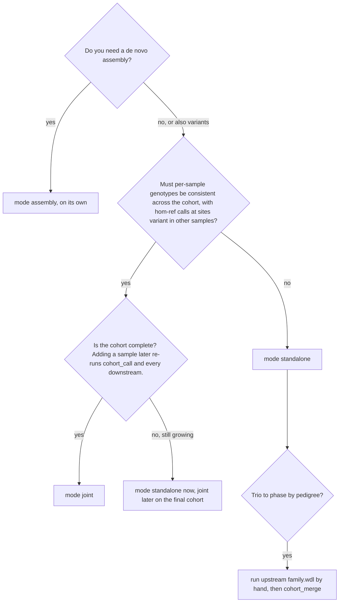
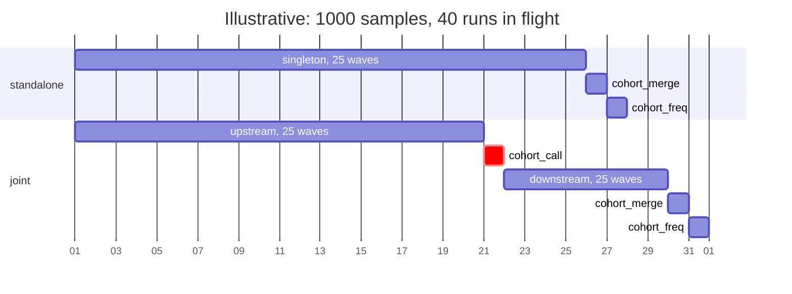

# Choosing a mode

## Decision tree



Text version: assembly is its own mode and can run beside either of the other
two. Choose `joint` only when genotypes must be cohort-consistent and the
cohort will not change; otherwise `standalone`. Joint mode is about
consistency, not sensitivity: it finds no variant that standalone mode
misses (below). Pedigree-aware phasing of a trio is not a driver mode; see
the end of the chapter.

## What each mode gives and costs

| | `standalone` | `joint` |
|---|---|---|
| Per-sample small variants | DeepVariant calls, phased per sample. | GLnexus joint calls sliced back per sample, so each VCF contains hom-ref records at sites variant elsewhere in the cohort; then phased per sample. |
| Per-sample SVs | sawfish discover and call per sample. | Same by default (`run_sawfish_call`); optionally one multi-sample sawfish call in `cohort_call` (`run_sawfish_joint_call`) whose per-sample slices feed `downstream`. |
| Cohort files | Merged SV VCF, merged TRGT VCF, LPS table; optional unphased GLnexus VCF made in `cohort_merge`; frequency files from `cohort_freq` (small variants only with that GLnexus VCF). | Merged SV VCF, merged TRGT VCF, LPS table; the GLnexus VCF comes from `cohort_call`; frequency files from `cohort_freq`. |
| Ordering | Every sample runs `singleton` independently; `cohort_merge` waits for all of them, `cohort_freq` for `cohort_merge`. | Every sample runs `upstream`; `cohort_call` waits for all; every `downstream` waits for `cohort_call`; `cohort_merge` waits for all `downstream`; `cohort_freq` for `cohort_merge`. |
| Wall-clock | Per-sample runs fill the cluster continuously. | Two barriers: nothing is phased until the last `upstream` finishes and `cohort_call` (hours) is done. |
| Adding a sample later | Run `singleton` for it; re-run `cohort_merge` and `cohort_freq` under a new cohort ID. | Re-run `cohort_call` for the new cohort, then `downstream` for **every** member, then `cohort_merge` and `cohort_freq`. |
| Multi-sample sawfish | Not possible: `singleton.wdl` does not expose the discover tarball. | Possible. |
| Re-phasing after a HiPhase upgrade | Re-run `singleton` (everything). | Re-run `downstream` only. |

The wall-clock shape of a 1000-sample cohort at 40 runs in flight, drawn to
illustrate the barriers rather than to predict durations:



## What joint calling adds, and what it does not

`cohort_call` is a multi-sample step, and upstream calls it joint calling,
but it is joint *genotyping* from gVCFs, not joint *discovery* from reads.
DeepVariant decides per sample, from that sample's reads alone, which
alleles exist, and writes a gVCF with a variant record or a reference block
at every position. GLnexus reads only those gVCFs: it unifies the alleles
found across the cohort and derives every sample's genotype at every site
from that sample's own record, never opening a BAM. A site that no sample
called on its own cannot appear, so the union of the per-sample calls is
the ceiling in both modes.

The local smoke test (four chr20 samples, the harness under `tests/smoke/`)
shows the consequence: the cohort GLnexus VCF of `cohort_merge` in standalone
mode and the one of `cohort_call` in joint mode are byte-identical (219,547
records), and so are the `cohort_freq` files. Per sample, joint mode found
nothing new; for HG002 it kept 156,661 of the 157,871 non-reference calls of the
standalone run and revised the other 1,210 (0.8 percent, median GQ 14) to
hom-ref, while adding 40,088 hom-ref records at sites variant in other members.
Ts/Tv, het/hom, SV and tandem-repeat counts were unchanged. The only step of the
pipeline that looks across samples' read evidence is sawfish's multi-sample call
(`run_sawfish_joint_call` in `cohort_call`, off by default), which can genotype
an SV in a member whose single-sample call missed it.

| | `joint` gives | `standalone` gives |
|---|---|---|
| Per-sample VCF | A genotype at every cohort site: "reference" and "not assessed" are distinguishable, and the per-sample and cohort files share sites and allele representation. Weak calls revised to hom-ref by GLnexus. | DeepVariant's own VCF, the form GIAB benchmarks and published performance numbers refer to. |
| SVs | Optionally one multi-sample sawfish call: SV genotypes comparable across members, an SV genotyped in a member whose own call missed it. | Per-sample sawfish, then a VCF merge (svx). |
| Cohort files | The same GLnexus VCF, frequencies, merged TR and SV sets as standalone. | The same. |
| Stability | Every member's `downstream` depends on the cohort's composition: a revised cohort re-runs `cohort_call` and all of `downstream`. | A sample's VCF, phasing, summary and QC are final the day it is processed; a new cohort touches only the cohort stages. |
| Scale | Two cohort-wide barriers; results belong to a cohort. | One validated workflow per sample, failures isolated, the call cache at its most useful. |

For a collection that accumulates samples over years, standalone is the
default: process each sample once, freeze a cohort whenever an analysis set
is defined and run its cohort stages. Joint mode is for a defined study
cohort where cohort-consistent per-sample files matter or where SV
genotypes must be comparable across members (families, a case-control set
with SV analyses), accepting that its per-sample outputs belong to that
cohort.

## Trio families

Upstream's `family.wdl` joint-calls and phases a family together.
ugc-pacbio-wgw has no driver stage for it: run
`vendor/hifi-human-wgs-wdl/workflows/family.wdl` by hand with miniwdl for the
few trios that need it, then include the samples' outputs in a `cohort_merge`
the same way as any singleton run. The assembly stage does use the pedigree,
automatically, for trio binning (chapter 05).

## Running assembly alongside variant calling

A `submit` session walks one mode, and a project accepts one driver at a
time, so within one project assembly runs before or after the variant
stages, never beside them. To overlap the two, give assembly a project of
its own on the same samples:

```bash
ugc-wgw init /proj/ugc/projects/cohort2026-asm --install /proj/ugc/current \
    --ref-map /proj/ugc/current/references/ugc_wgw_ref_map.GRCh38_GIABv3.tsv \
    --results /proj/ugc/results/cohort2026-asm
cd /proj/ugc/projects/cohort2026-asm
ugc-wgw samples add samples.tsv        # the same sheet: the pedigree drives trio binning
ugc-wgw submit --mode assembly --max-inflight 4
```

The two projects run at the same time, on the same host or on different
hosts. They share the call cache and the SIF cache and nothing else: each
has its own status, report, lease and `stage_inputs` (hifiasm memory and
threads belong in the assembly project's `config.json`).

A large-memory partition for assembly is not a reason for a second project:
one row in the site's resource policy, `ugc_wgw_hifiasm_assemble` with
`partition` `fat` (chapter 12), sends hifiasm there in every project that
uses the install, while the other tasks stay on the default partition.

Combined modes that would run both branches in one session are a possible
later change; they are not planned while the two-project pattern covers the
need.

## Switches that are inputs, not modes

These change what a stage does without changing the stage sequence. They are
set per project in `stage_inputs` (chapter 05) and listed with their defaults
in chapter 08.

| Switch | Stage | Default | Effect |
|---|---|---|---|
| `run_sawfish_call` | `upstream` | `true` | Per-sample sawfish call, so `upstream` produces an SV VCF. Set `false` only when `run_sawfish_joint_call` will provide one. |
| `run_sawfish_joint_call` | `cohort_call` | `false` | One multi-sample sawfish call over the cohort's discover tarballs and BAMs; per-sample slices then feed `downstream`. |
| `split_keep_homref` | `cohort_call` | `true` | Keep hom-ref records in the per-sample slices (upstream parity); `false` keeps only sites with an alternate allele. |
| `sv_merge_method` | `cohort_merge` | `"svx"` | `svx` merges by breakpoint similarity per contig plus one genome-wide BND job; `bcftools` is a site union per shard. |
| `run_glnexus` | `cohort_merge` | `true` in standalone, `false` in joint | Unphased cohort GLnexus VCF from the members' gVCFs. Redundant in joint mode, where `cohort_call` made it. |
| `merge_phased_small_variants` | `cohort_merge` | `false` | One cohort VCF made by `bcftools merge` of the phased per-sample small-variant VCFs, scattered by shard. |
| `use_gpu`, `use_parabricks_deepvariant`, `gpuType` | `singleton`, `upstream` | from `config.json` | DeepVariant on a GPU, or Parabricks. Not set here: the project's `deepvariant` switch (`ugc-wgw init --deepvariant gpu\|parabricks`, chapter 12) fills all three and the install must carry `--nv` and a GPU partition. |
| `use_alignment_chunking` | `singleton`, `upstream` | `true` | pbmm2 aligns each input BAM in 16 chunks; `false` aligns it whole. An already aligned input is always realigned whole. |
