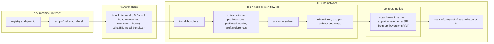

# Install

A bundle is one tarball made on the dev machine with `scripts/make-bundle.sh`.
It contains the code (with the vendored upstream), every container image as a
Singularity Image File, the workflow engine as wheels for one Python version,
and a manifest with the checksum of every file. Installing it on the HPC needs
no network. The reference data travels inside the bundle too, as PacBio's
reference data container: the installer copies it out once into a directory
shared by all versions.

## What arrives

| File | Purpose |
|---|---|
| `ugc-pacbio-wgw-<v>.tar` | The bundle. About 26 GB with all images, the reference data container among them. |
| `ugc-pacbio-wgw-<v>.tar.sha256` | Checksum of the tar; the installer verifies it when present. |
| `install-bundle.sh` | The installer, shipped loose so it can run before anything is unpacked. It is also inside the tar. |

## Prerequisites on the HPC

- `bash`, `tar`, `coreutils`, and a `python3` whose major.minor version equals
  the bundle's `python_version` (the installer prints both and refuses a
  mismatch; the dev machine then rebuilds with `--python-version X.Y`).
- `apptainer` on `PATH` on the submit host and the compute nodes; the
  installer runs it once to copy the reference data out of its container.
- A writable `<prefix>` on a filesystem that compute nodes can read.
- SLURM: a partition and account for the tasks. Jobs may submit jobs, since
  the driver and miniwdl run on a login node or in a job of their own.
- A node-local, large `$TMPDIR` on compute nodes: GLnexus keeps its database
  there while a shard runs.

## Deployment picture



Text version:

```
dev machine (internet)      transfer share                 HPC (no network)
make-bundle.sh ───────────► bundle tar + .sha256 ─────────► install-bundle.sh
  pulls images to SIFs      install-bundle.sh                 ├─► <prefix>/versions/<v>/
  (reference data container                                   └─► <prefix>/references/
   among them)                                                    (copied out of the SIF once)
  downloads wheels
                                                            ugc-wgw submit (login node / job)
                                                              └─► miniwdl run ×N
                                                                    └─► sbatch --wait per task
                                                                          apptainer exec <sif>
                                                            <results>/samples/<id>/<v>/<stage>/
```

## Step by step

### 1. Decide where the references live

The installer's `--references` directory (default `<prefix>/references`) is
shared by all versions and must be readable from the compute nodes. On the
first install it copies the build's tree and its `manifest.json` out of the
reference data container's SIF (3.2 GB, a few minutes):

```
<references>/hifi-wdl-resources-v4.0.0-GRCh38_GIABv3/
├── GRCh38_GIABv3/      the fasta and its index, trgt/, sawfish/, methbat/
└── manifest.json       the container's own list of those files and three scalars
```

then verifies every file's md5 against `references.lock` and renders the
reference map. A later install finds the tree, verifies it and reuses it. The
installer also copies `scatter_regions.GRCh38_GIABv3.tsv` into
`<references>/ugc-wgw-extras-0.2.0/` when the directory is writable, and warns
otherwise; then copy it yourself from `<prefix>/versions/<v>/code/references/`.
The archival form of the same data is PacBio's Zenodo tar named in
`references.lock`; extracting it under `<references>/` gives the same tree
and is only needed when a bundle was built without images.

### 2. Write a site file

`KEY=VALUE` lines, no shell expansion; every key is optional. A copy to start
from is in `examples/site.cfg`; the reference is
`backends/hpc/site.cfg.example`.

| Key | Default | Becomes |
|---|---|---|
| `SLURM_PARTITION` | empty | `[task_runtime] defaults.slurm_partition`: `--partition` of every task job; a policy row can move single tasks elsewhere (chapter 12). |
| `SLURM_ACCOUNT` | empty | `[task_runtime] defaults.slurm_account`: `--account` of every task job. |
| `SLURM_EXTRA_ARGS` | empty | `[slurm] extra_args`: appended to every `sbatch` after the per-task arguments: qos, reservation, mail. Never the partition or account: `sbatch` keeps the last `--partition` it sees, which would defeat per-task rows, and the installer refuses that combination. |
| `SLURM_PARTITION_GPU` | empty | `[task_runtime] defaults.slurm_partition_gpu`: the partition of every task that asks for GPUs (miniwdl-slurm uses it instead of `slurm_partition` for those); needed when a project sets `deepvariant` to `gpu` or `parabricks` (chapter 12). |
| `SLURM_ACCOUNT_GPU` | empty | `[task_runtime] defaults.slurm_account_gpu`: same for the account, only when the GPU partition is billed differently. |
| `SINGULARITY_NV` | `0` | `1` appends `--nv` to `[singularity] run_options`, which binds the node's NVIDIA driver into every container; without it a GPU task finds no device. Harmless on nodes without a driver (Apptainer warns). |
| `TASK_CPU_MAX` | `0` | `[task_runtime] cpu_max`: no task asks for more cores than this; `0` = no cap. Set the node's core count (chapter 12). |
| `TASK_MEMORY_MAX` | `0` | `[task_runtime] memory_max`: same for memory, with a binary unit (`375G` = a 384000 MB node); `0` = no cap. |
| `TASK_RESOURCES` | `<prefix>/resources.tsv` | `[ugc_wgw] resources`: the per-task resource policy (chapter 12). Created from `backends/hpc/resources.tsv.example` when absent, validated when present. |
| `TASK_CONCURRENCY` | `50` | `[scheduler] task_concurrency`: SLURM jobs one miniwdl process keeps in flight. Total pressure is this times the driver's `--max-inflight`. |
| `TASK_TIME_MINUTES` | `4320` | `[task_runtime] defaults.time_minutes`: wall time for tasks that set none (all upstream tasks); three days. A policy row can set it per task. |
| `CALL_CACHE_DIR` | `<prefix>/call_cache` | `[call_cache] dir`, shared by all versions. Keep it on fast shared storage. |

### 3. Verify without installing

```bash
./install-bundle.sh --bundle ugc-pacbio-wgw-0.2.0.tar --prefix /proj/ugc --verify-only
```

This checks the tar's `.sha256`, unpacks into `<prefix>/.staging/`, verifies
the size and sha256 of every file against `manifest.json` (an unlisted file is
an error), checks the Python version, builds a throwaway virtual environment
from the wheels, runs `miniwdl check --strict` on every entrypoint, checks
that the `ugc_wgw_resources` task plugin is registered in that environment,
prints the engine and plugin versions, says whether the reference data
container is in the bundle, and removes the staging directory. It ends with
`verify-only passed for ugc-pacbio-wgw-0.2.0`.

### 4. Install and activate

```bash
./install-bundle.sh --bundle ugc-pacbio-wgw-0.2.0.tar --prefix /proj/ugc \
    --references /proj/ugc/references --site site.cfg --activate
```

The installer refuses to overwrite an existing `<prefix>/versions/<v>` unless
`--force` is given. `--activate` repoints `<prefix>/current`; without it the
version is installed but not current. The last lines of the output are the
paths the driver needs and the `ugc-wgw init` line to copy:

```
install_dir=/proj/ugc/versions/0.2.0
code=/proj/ugc/versions/0.2.0/code
miniwdl=/proj/ugc/versions/0.2.0/venv/bin/miniwdl
cfg=/proj/ugc/versions/0.2.0/miniwdl.cfg
sif_cache=/proj/ugc/versions/0.2.0/sif
references=/proj/ugc/references/hifi-wdl-resources-v4.0.0-GRCh38_GIABv3
ref_map=/proj/ugc/versions/0.2.0/references/ugc_wgw_ref_map.GRCh38_GIABv3.tsv
inputs_templates=/proj/ugc/versions/0.2.0/inputs
ugc_wgw=/proj/ugc/versions/0.2.0/code/bin/ugc-wgw
resources=/proj/ugc/resources.tsv
plugin=ugc-wgw-miniwdl 0.1.0
# next: /proj/ugc/versions/0.2.0/code/bin/ugc-wgw init <project_dir> --install /proj/ugc/versions/0.2.0 --ref-map ...
```

The rendered map is checked against the container's `manifest.json`; a
mismatch or a missing file is an error. If the bundle carries no reference
data container and the tree is absent, the installer warns and renders the
map anyway; then extract the archival tar under `--references` and install
again with `--force`.

## The prefix after installation

```
<prefix>/
├── versions/<v>/
│   ├── code/                 the repository at the tagged commit (workflows/, vendor/, bin/, docs/)
│   ├── sif/                  one .sif per container image, named by miniwdl's rule
│   ├── wheels/               miniwdl, miniwdl-slurm, their dependencies, pip, the ugc-wgw-miniwdl plugin
│   ├── venv/                 python3 -m venv with the wheels installed; venv/bin/miniwdl
│   ├── miniwdl.cfg           rendered from backends/hpc/miniwdl.cfg.template and the site file
│   ├── references/           the rendered reference map for this version (ugc_wgw_ref_map.<build>.tsv)
│   ├── inputs/               rendered inputs templates, one per stage (for running a stage by hand)
│   ├── manifest.json         what the bundle contained, with checksums and image digests
│   └── install-bundle.sh
├── current -> versions/<v>   set by --activate only
├── resources.tsv             the site resource policy (chapter 12); created once, never overwritten
├── call_cache/               miniwdl call cache shared by all versions
└── references/               hifi-wdl-resources-v4.0.0-GRCh38_GIABv3/, ugc-wgw-extras-0.2.0/
```

Several versions coexist under `versions/`; a project's `config.json` records
the resolved version directory it was initialised against, so activating a
newer version does not move running projects (chapter 10).

## The rendered `miniwdl.cfg`

The driver passes `<prefix>/versions/<v>/miniwdl.cfg` to every run. These are
the settings an operator may need to know or change; edit the file in place
and the next run picks it up.

| Section and key | Value | Why |
|---|---|---|
| `[scheduler] container_backend` | `slurm_singularity` | Tasks become SLURM jobs running Apptainer. |
| `[scheduler] task_concurrency` | site value, default 50 | Jobs in flight per miniwdl process. |
| `[scheduler] fail_fast` | `false` | A failed task does not cancel the run's other tasks; the retry is then cheap through the call cache. |
| `[file_io] allow_any_input` | `true` | Required: the reference map names files that are not declared inputs. |
| `[file_io] copy_input_files` | `false` | Never copies the uBAMs. |
| `[file_io] output_hardlinks`, `delete_work` | `true`, `success` | Work directories of successful runs are reclaimed; failed runs keep theirs for diagnosis. |
| `[call_cache] dir` | site value | Shared across versions. |
| `[singularity] exe` | `["apptainer"]` | |
| `[singularity] image_cache` | `<prefix>/versions/<v>/sif` | Every image must already be here; miniwdl never pulls. |
| `[singularity] run_options` | `--containall --no-mount hostfs`, plus `--nv` with `SINGULARITY_NV=1` | `--nv` is what lets the GPU DeepVariant and Parabricks tasks see a device (chapter 12). |
| `[slurm] extra_args` | site value | Qos, reservation and the like; never the partition (chapter 12). |
| `[task_runtime] command_shell` | `/bin/bash` | Upstream commands use bash arrays. |
| `[task_runtime] cpu_max`, `memory_max` | site values, default `0` | Caps on any task's request; miniwdl rounds larger requests down and logs it (chapter 12). Memory is rendered in bytes. |
| `[task_runtime] defaults` | one JSON line: `docker ubuntu:20.04`, `maxRetries 1`, `time_minutes`, `slurm_partition`, `slurm_account`, `slurm_partition_gpu`, `slurm_account_gpu` (site values) | Wall time, partition and account for every task that sets none; the `_gpu` pair applies to tasks that ask for GPUs. The `docker` entry is miniwdl's own default and must stay: miniwdl reads it before every pull. Keep the dict on one line. |
| `[ugc_wgw] resources` | site value | The per-task resource policy applied by the `ugc_wgw_resources` plugin (chapter 12). |

How a SIF is named: `docker://` plus the image reference with every `/` and
`:` replaced by `_`, plus `.sif`. `quay.io/pacbio/glnexus@sha256:ce6f...`
becomes `docker___quay.io_pacbio_glnexus@sha256_ce6f....sif`. The container
registry names written into the rendered inputs must therefore match the
names the images were cached under; the installer takes them from the bundle.
