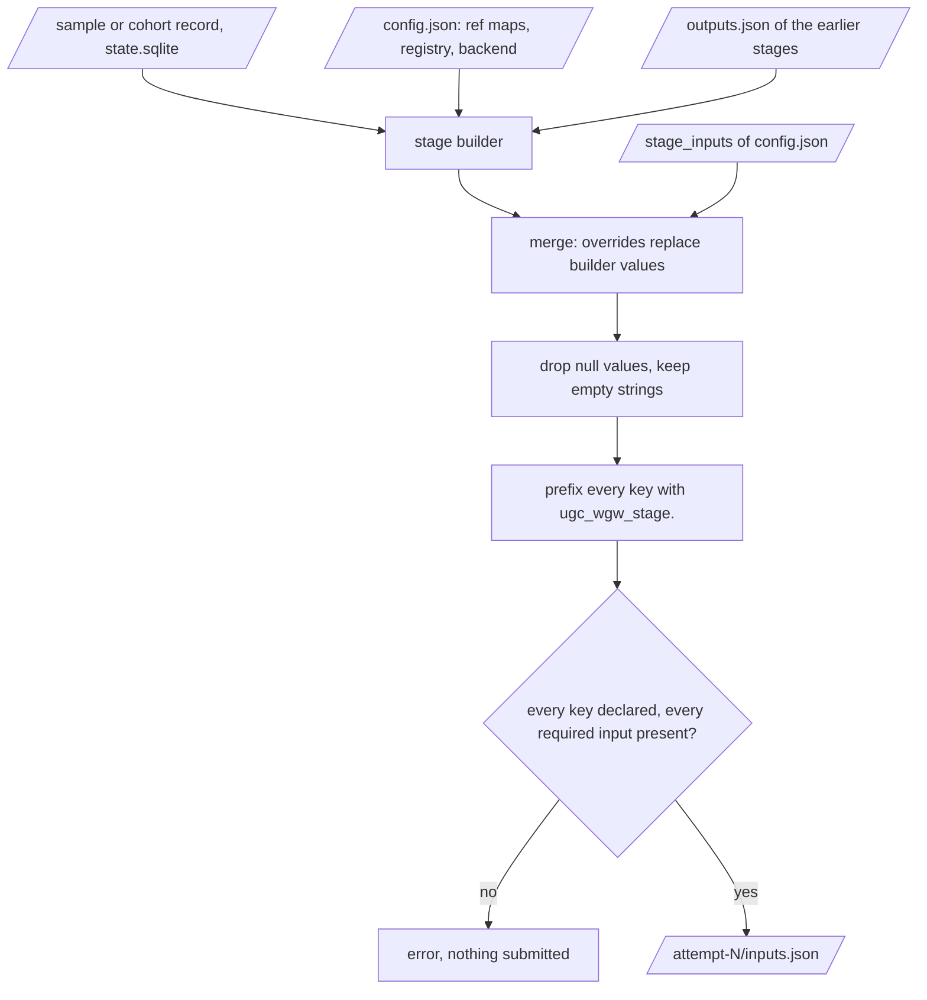
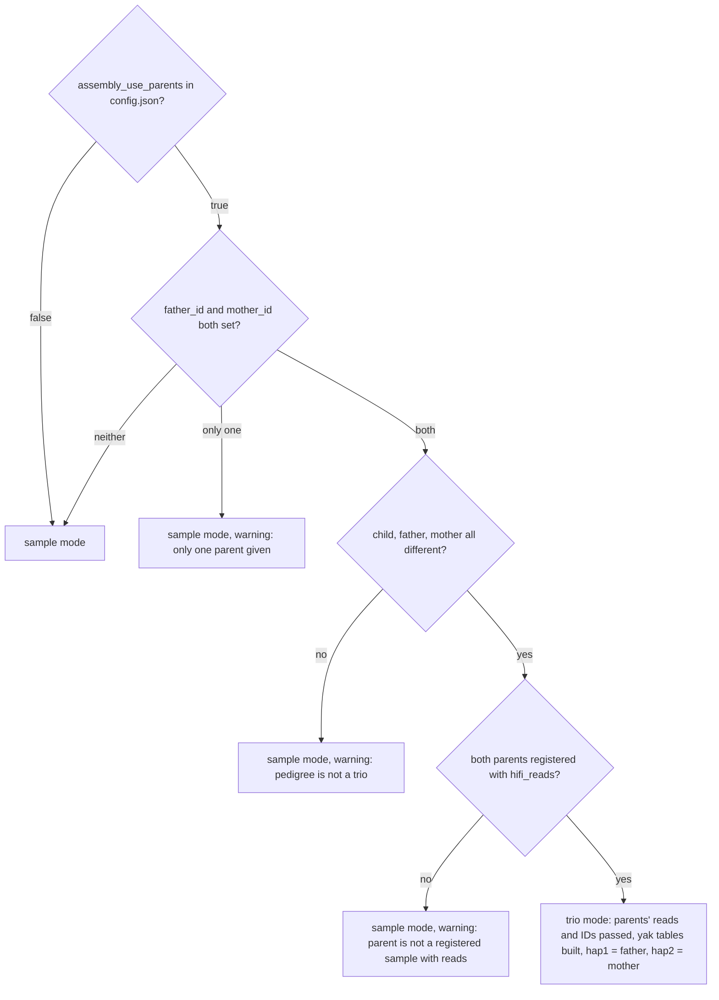

# Project setup

A project is a directory with a `.ugc-wgw/` subdirectory: the configuration, the
state database and the driver's logs. Results go under the project directory
too unless `--results` points elsewhere. One project per campaign is the
intended shape; a project belongs to one installed version until you decide
otherwise (chapter 10).

## `ugc-wgw init`

```bash
ugc-wgw init /proj/ugc/projects/cohort2026 --install /proj/ugc/current \
    --ref-map /proj/ugc/current/references/ugc_wgw_ref_map.GRCh38_GIABv3.tsv \
    --results /proj/ugc/results/cohort2026
```

The installer prints this line with the right paths at the end of an install.
`--install` may be `<prefix>/current` or `<prefix>/versions/<v>`; the driver
resolves the symlink and stores the versioned paths, so the project stays on
that version even after another one is activated.

| Flag | Default | Meaning |
|---|---|---|
| `project_dir` | required | Where `.ugc-wgw/` is created. Refuses to run if it already exists. |
| `--install DIR` | | Install version directory; derives `code/`, `venv/bin/miniwdl`, `miniwdl.cfg` and `venv/` from it. All four must exist. |
| `--code`, `--miniwdl`, `--cfg` | | The three paths individually, for a checkout without an install prefix (dev machine). Either `--install` or all three. |
| `--venv DIR` | | Engine virtual environment, used only to report the miniwdl-slurm version in manifests. |
| `--results DIR` | the project dir | Results root. |
| `--ref-map FILE` | required | The reference map rendered by the installer (`ref_map=` in its report): reference files, scalars and scatter regions of one build. Passed to every stage. |
| `--registry STR` | `ghcr.io/uppsalagenomecenter` | Registry prefix of the ugc-built images (svx, trgt-lps, hifiasm), as they were cached. |
| `--max-inflight N` | `4` | Default number of concurrent miniwdl runs for `submit`. |
| `--poll-interval SEC` | `30` | Default seconds between polls in `submit`. |
| `--no-assembly-parents` | off | Assembly mode never trio-bins. |
| `--deepvariant cpu\|gpu\|parabricks` | `cpu` | Small-variant caller of `singleton` and `upstream`: DeepVariant on CPUs, its `call_variants` step on one GPU, or NVIDIA Parabricks (chapter 12, "GPU tasks"). |
| `--gpu-type TYPE` | empty | SLURM gres type of the GPU tasks (`a100`: `--gres gpu:a100:N`); empty asks for any GPU (`gpu:N`). |
| `--parabricks-gpus N` | `4` | GPUs per Parabricks task; must not exceed one node's. |

The command checks that the code directory, the miniwdl executable and the
reference map exist and that `VERSION` in the code directory is non-empty. A
missing `miniwdl.cfg` is only a warning at this point; `submit` refuses to run
without it.

## `.ugc-wgw/config.json`

Edit it with a text editor when a default has to change; the file is rewritten
sorted by key.

| Key | Default | Meaning |
|---|---|---|
| `schema` | `1` | Config schema version. A different value refuses to load. |
| `code_dir`, `miniwdl`, `miniwdl_cfg`, `venv_dir` | from `init` | Engine paths. `venv_dir` may be `null`. |
| `results_dir` | project dir | Results root. |
| `ref_map_file` | from `init` | The reference map. The 0.1.0 keys `ugc_wgw_ref_map_file` and `tertiary_map_file` are ignored with a warning. |
| `ugc_wgw_container_registry` | `ghcr.io/uppsalagenomecenter` | Passed to `cohort_merge` and `assembly`. |
| `backend` | `"HPC"` | Passed to every stage; selects upstream's HPC backend configuration. |
| `preemptible` | `true` | Passed to every stage; has no effect on the HPC. |
| `max_inflight` | `4` | Concurrency cap for `submit` unless overridden on the command line. |
| `poll_interval` | `30.0` | Seconds between polls. |
| `assembly_use_parents` | `true` | Master switch for trio binning in assembly mode. |
| `deepvariant` | `"cpu"` | `cpu`, `gpu` or `parabricks`: fills `use_gpu`, `use_parabricks_deepvariant`, `gpuType` and Parabricks' GPU count for `singleton` and `upstream` (chapter 12). |
| `gpu_type`, `parabricks_gpus` | `""`, `4` | The gres type and the Parabricks GPU count behind that switch. |
| `stage_inputs` | `{}` | Per-stage input overrides, below. |

## Stage input overrides

Every workflow input that the driver does not fill from the sample sheet or
from earlier stages can be set per project under `stage_inputs`, keyed by the
stage name. The value is merged into the generated inputs file **after** the
driver's own values, so an override always wins, and the result is checked
against the workflow's input block: a key the workflow does not declare is an
error before anything is submitted. Cores, memory and wall time of the
upstream tasks are not workflow inputs; they are set per site by caps and
the resource policy (chapter 12).

```json
{
  "stage_inputs": {
    "cohort_merge": {"sv_merge_method": "bcftools", "svx_mem_gb": 24},
    "cohort_call": {"run_sawfish_joint_call": true, "glnexus_mem_gb": 200},
    "assembly": {"hifiasm_mem_gb": 384, "hifiasm_extra_params": "--hg-size 3g"},
    "upstream": {"use_alignment_chunking": false}
  }
}
```

Both `cohort_merge` and `ugc_wgw_cohort_merge` are accepted as keys; the
namespaced form wins when both exist. Chapter 08 lists every input per stage
with its default. A dotted key names an input of a call inside the
entrypoint (the driver itself sets
`upstream.parabricks_deepvariant.run_parabricks_deepvariant.gpuCount` for
Parabricks); the driver checks only
that the first segment is a call of the entrypoint and miniwdl checks the
rest when the run starts. The DeepVariant flavour is not a stage input but
the `deepvariant` key above, which sets `use_gpu`, `use_parabricks_deepvariant`
and `gpuType` consistently for both stages; `stage_inputs` still win over
it.



`ugc-wgw inputs <subject> --stage <stage> [--mode M] [--cohort ID]` prints the
inputs JSON that `submit` would write, so you can see the effect of an override
before running anything. For a stage that reads earlier outputs it fails with
the name of the member and output that is missing.

## Registering samples

```bash
ugc-wgw samples add samples.tsv
ugc-wgw samples list
```

The sample sheet is tab-separated with a header row. `examples/samples.tsv`
is a complete example.

| Column | Required | Content |
|---|---|---|
| `sample_id` | yes | Matches `[A-Za-z0-9._-]+`; it becomes a directory name and the sample name in every VCF and BAM. |
| `hifi_reads` | yes | One or more unaligned HiFi BAM paths, comma-separated. All are aligned and merged. |
| `sex` | no | `MALE`, `FEMALE` or blank; case-insensitive. Advisory only (chapter 02). |
| `fail_reads` | no | Fail-reads BAMs, comma-separated, for upstream's TRGT baiting. |
| `father_id`, `mother_id` | no | Pedigree. Drive trio binning in assembly mode; otherwise informational. |
| anything else | no | Kept as metadata on the sample record (`meta_json`), not used by any stage. |

Rules:

- Paths are made absolute and symlinks resolved. Every path must exist unless
  `--no-check` is given (useful for a sheet prepared before the data lands).
- A sample already registered is an error unless `--replace` is given, which
  overwrites its record and reads; its runs are kept.
- A duplicate `sample_id` inside one sheet is an error. A blank `sample_id`
  skips the row.
- A `father_id` or `mother_id` that is not a registered sample (nor in the same
  sheet) is a warning, recorded as a `sample.warning` event.

A sequencing facility usually delivers one row per BAM file, with a
PLINK-style pedigree (`family_id`, `paternal_id`, `maternal_id`, sex coded
1/2/0). `scripts/manifest-to-samples.py` turns such a manifest, CSV or TSV,
into this sheet: one row per sample, its files joined in manifest order
(a file named `*.fail_reads.*` goes to `fail_reads`), sex recoded, `0`/`NA`
parents blanked, every other column kept as metadata, and it refuses a
manifest whose rows disagree about a sample's sex, parents or metadata.

```bash
python3 scripts/manifest-to-samples.py delivery.csv -o samples.tsv [--project study_plates1-8] [--check]
ugc-wgw samples add samples.tsv
```

`ugc-wgw samples list --mode M` shows every sample with its latest run status
per sample stage of the mode; `--status failed,running` filters, `--json` gives
the same as JSON. Listing reconciles runs left active by a crashed driver first
(chapter 06).

## Freezing a cohort

```bash
ugc-wgw cohort freeze C1 --samples cohort.txt
```

The file has one sample ID per line; `#` comments and blank lines are ignored
and only the first token of a line is read. `examples/cohort.txt` shows the
format. Every ID must be a registered sample; duplicates and an empty list are
errors. The cohort ID matches `[A-Za-z0-9._-]+`.

Freeze when the membership is final. The cohort is immutable and the order is
the order of every array the cohort stages receive. A joint-mode `submit`
needs `--cohort` from the first stage on, because the plan for `downstream`
depends on it; a standalone `submit` needs it only when `cohort_merge` should
run. There is no unfreeze; a changed membership is a new cohort ID, and the
cohort stages run again for it while the per-sample stages are re-used.

## Assembly mode and the pedigree

Assembly has no cohort and no prerequisites. When a sample is submitted in
assembly mode, the driver decides between trio binning and sample mode from
the pedigree at input-generation time:



The parents need no assembly run of their own, only registration with reads.
Parents and children can be submitted in the same wave. The warnings go to
`.ugc-wgw/logs/ugc-wgw.log` (and to the terminal with `-v`).
