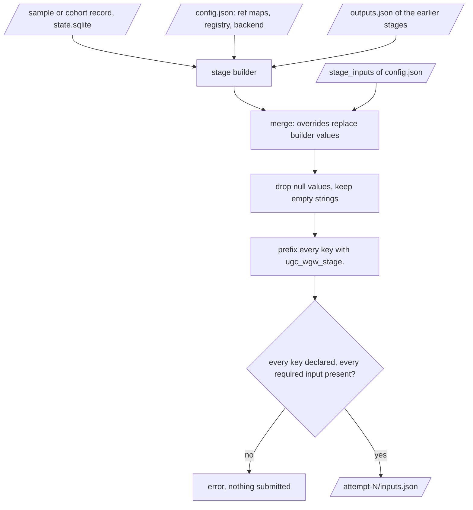
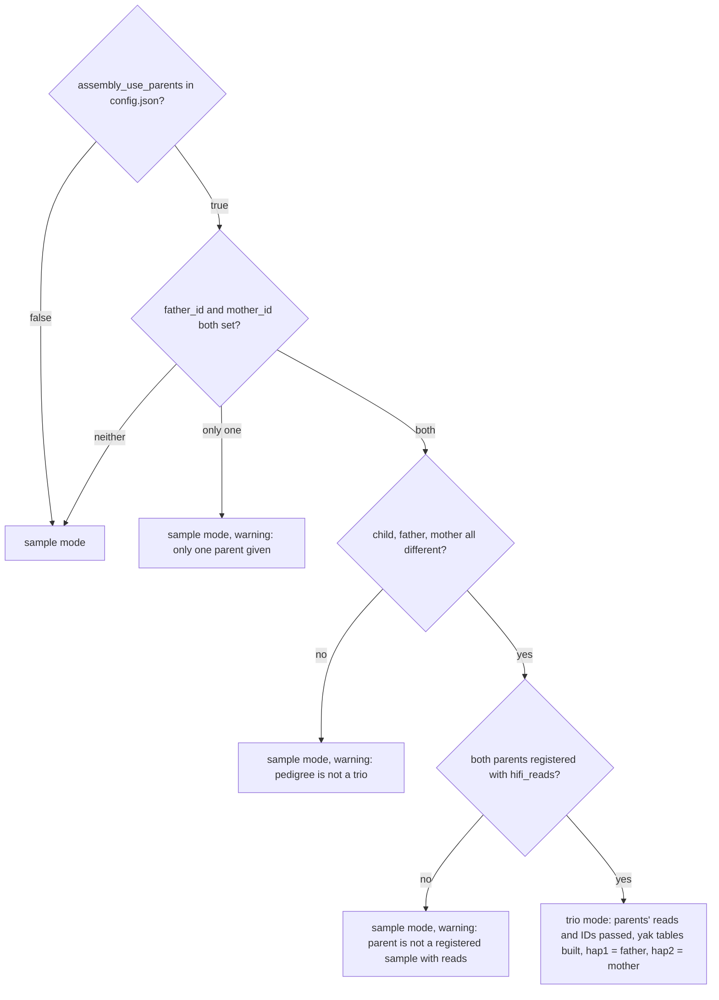

# Project setup

A project is a directory with a `.ugc-wgw/` subdirectory: the configuration, the
state database and the driver's logs. Results go under the project directory
too unless `--results` points elsewhere. One project per campaign is the
intended shape; a project belongs to one installed version until you decide
otherwise (chapter 10).

## `ugc-wgw init`

```bash
ugc-wgw init /proj/ugc/projects/cohort2026 --install /proj/ugc/current \
    --ref-map /proj/ugc/current/references/ugc_wgw_ref_map.GRCh38_GIABv3.tsv \
    --results /proj/ugc/results/cohort2026
```

The installer prints this line with the right paths at the end of an install.
`--install` may be `<prefix>/current` or `<prefix>/versions/<v>`; the driver
resolves the symlink and stores the versioned paths, so the project stays on
that version even after another one is activated.

Add `--profile NAME` to start from a site profile instead of editing
`config.json` afterwards:

```bash
ugc-wgw init /proj/ugc/projects/cohort2026 --install /proj/ugc/current \
    --ref-map /proj/ugc/current/references/ugc_wgw_ref_map.GRCh38_GIABv3.tsv \
    --results /proj/ugc/results/cohort2026 --profile cpu
```

A profile is a JSON file with the project keys that depend on the cluster
and the sample set: `stage_inputs`, `deepvariant`, `gpu_type`,
`parabricks_gpus`, `max_inflight`, `poll_interval`, `assembly_use_parents`,
`prices`, `summary_thresholds` and `input_thresholds`, plus a
`description`. `NAME` is looked
up as `<prefix>/profiles/NAME.json` (the installer places the examples
there once and never overwrites them, so a site edits them in place), then
as `backends/hpc/profiles/NAME.json` in the code; a path to a file works
too. The bundle ships `cpu` (no alignment chunking, pbmm2 on 24 threads so
two alignments share a 48-core node, 20 runs in flight) and `parabricks`
(the same with Parabricks on 4 GPUs). Flags given on the command line win
over the profile. The profile's values are copied into `config.json`, and
`profile` there records its name, path, checksum and the keys it set, so a
project stays self-contained while the site's profile evolves;
`ugc-wgw stage-inputs` marks the overrides that came from it, and the run
report names it under Provenance.

| Flag | Default | Meaning |
|---|---|---|
| `project_dir` | required | Where `.ugc-wgw/` is created. Refuses to run if it already exists. |
| `--install DIR` | | Install version directory; derives `code/`, `venv/bin/miniwdl`, `miniwdl.cfg` and `venv/` from it. All four must exist. |
| `--code`, `--miniwdl`, `--cfg` | | The three paths individually, for a checkout without an install prefix (dev machine). Either `--install` or all three. |
| `--venv DIR` | | Engine virtual environment, used only to report the miniwdl-slurm version in manifests. |
| `--results DIR` | the project dir | Results root. |
| `--ref-map FILE` | required | The reference map rendered by the installer (`ref_map=` in its report): reference files, scalars and scatter regions of one build. Passed to every stage. |
| `--registry STR` | `ghcr.io/uppsalagenomecenter` | Registry prefix of the ugc-built images (svx, trgt-lps, hifiasm), as they were cached. |
| `--profile NAME\|FILE` | none | A site profile applied before the flags below (above). |
| `--max-inflight N` | `4` | Default number of concurrent miniwdl runs for `submit`. |
| `--poll-interval SEC` | `30` | Default seconds between polls in `submit`. |
| `--no-assembly-parents` | off | Assembly mode never trio-bins. |
| `--deepvariant cpu\|gpu\|parabricks` | `cpu` | Small-variant caller of `singleton` and `upstream`: DeepVariant on CPUs, its `call_variants` step on one GPU, or NVIDIA Parabricks (chapter 12, "GPU tasks"). |
| `--gpu-type TYPE` | empty | SLURM gres type of the GPU tasks (`a100`: `--gres gpu:a100:N`); empty asks for any GPU (`gpu:N`). |
| `--parabricks-gpus N` | `4` | GPUs per Parabricks task; must not exceed one node's. |

The command checks that the code directory, the miniwdl executable and the
reference map exist and that `VERSION` in the code directory is non-empty. A
missing `miniwdl.cfg` is only a warning at this point; `submit` refuses to run
without it. It also warns when `--results` is on a different file system
than the install: a call-cache hit whose earlier output lives on the other
side is then symlinked into that tree rather than hardlinked (chapter 04,
"Decide where the references live").

## `.ugc-wgw/config.json`

Edit it with a text editor when a default has to change; the file is rewritten
sorted by key.

| Key | Default | Meaning |
|---|---|---|
| `schema` | `1` | Config schema version. A different value refuses to load. |
| `code_dir`, `miniwdl`, `miniwdl_cfg`, `venv_dir` | from `init` | Engine paths. `venv_dir` may be `null`. |
| `results_dir` | project dir | Results root. |
| `ref_map_file` | from `init` | The reference map. The 0.1.0 keys `ugc_wgw_ref_map_file` and `tertiary_map_file` are ignored with a warning. |
| `ugc_wgw_container_registry` | `ghcr.io/uppsalagenomecenter` | Passed to `cohort_merge` and `assembly`. |
| `backend` | `"HPC"` | Passed to every stage; selects upstream's HPC backend configuration. |
| `preemptible` | `true` | Passed to every stage; has no effect on the HPC. |
| `max_inflight` | `4` | Concurrency cap for `submit` unless overridden on the command line. |
| `poll_interval` | `30.0` | Seconds between polls. |
| `assembly_use_parents` | `true` | Master switch for trio binning in assembly mode. |
| `deepvariant` | `"cpu"` | `cpu`, `gpu` or `parabricks`: fills `use_gpu`, `use_parabricks_deepvariant`, `gpuType` and Parabricks' GPU count for `singleton` and `upstream` (chapter 12). |
| `gpu_type`, `parabricks_gpus` | `""`, `4` | The gres type and the Parabricks GPU count behind that switch. |
| `stage_inputs` | `{}` | Per-stage input overrides, below. |
| `profile` | `{}` | The profile `init --profile` applied: `name`, `path`, `sha256`, `applied` (the keys it set). Informational. |

## Stage input overrides

Every workflow input that the driver does not fill from the sample sheet or
from earlier stages can be set per project under `stage_inputs`, keyed by the
stage name. The value is merged into the generated inputs file **after** the
driver's own values, so an override always wins, and the result is checked
against the workflow's input block: a key the workflow does not declare is an
error before anything is submitted.

`ugc-wgw stage-inputs` prints the complete list: every input of every stage
with its type, default and description, who fills it (the driver, a
`config.json` key, or nobody, which makes it yours to set here) and the
project's current override. It warns about keys `submit` would refuse and
about overrides of values the driver fills. `--stage S` or `--mode M`
narrows it, `--json` gives the same rows to a script.

```bash
ugc-wgw stage-inputs --stage cohort_merge          # the knobs of one stage
ugc-wgw stage-inputs --nested --stage singleton    # plus the tasks' own inputs
```

With `--nested` the list also holds the call-qualified inputs of the tasks
and subworkflows inside the entrypoint, `<call>.<task>.<input>`, exactly as
miniwdl accepts them: thread counts, memory and tool options such as
`upstream.pbmm2.pbmm2_align_wgs.threads` or
`downstream.hiphase.phase_singletons`. Cores and memory of upstream's tasks
are therefore settable, though only through these nested keys; the resource
policy (chapter 12) remains the tool for the SLURM allocation alone, and the
nested input is for when the tool's own thread count or memory budget must
follow. Wall time is never an input: it comes from the site default and the
policy. A nested input is a task input, so changing it invalidates the call
cache of that task.

```json
{
  "stage_inputs": {
    "cohort_merge": {"sv_merge_method": "bcftools", "svx_mem_gb": 24},
    "cohort_call": {"run_sawfish_joint_call": true, "glnexus_mem_gb": 200},
    "assembly": {"hifiasm_mem_gb": 384, "hifiasm_extra_params": "--hg-size 3g"},
    "upstream": {"use_alignment_chunking": false}
  }
}
```

Both `cohort_merge` and `ugc_wgw_cohort_merge` are accepted as keys; the
namespaced form wins when both exist. Chapter 08 lists every input per stage
with its default. A dotted key names an input of a call inside the
entrypoint (the driver itself sets
`upstream.parabricks_deepvariant.run_parabricks_deepvariant.gpuCount` for
Parabricks); the driver checks only that the first segment is a call of the
entrypoint, miniwdl checks the rest when the run starts, and
`ugc-wgw stage-inputs --nested` checks it before. The DeepVariant flavour is not a stage input but
the `deepvariant` key above, which sets `use_gpu`, `use_parabricks_deepvariant`
and `gpuType` consistently for both stages; `stage_inputs` still win over
it.


```mermaid
flowchart TD
  sample[/"sample or cohort record, state.sqlite"/] --> b["stage builder"]
  cfg[/"config.json: ref maps, registry, backend"/] --> b
  prior[/"outputs.json of the earlier stages"/] --> b
  b --> merge["merge: overrides replace builder values"]
  ov[/"stage_inputs of config.json"/] --> merge
  merge --> drop["drop null values, keep empty strings"]
  drop --> ns["prefix every key with ugc_wgw_stage."]
  ns --> chk{"every key declared, every required input present?"}
  chk -->|"no"| err["error, nothing submitted"]
  chk -->|"yes"| file[/"attempt-N/inputs.json"/]
```

`ugc-wgw inputs <subject> --stage <stage> [--mode M] [--cohort ID]` prints the
inputs JSON that `submit` would write, so you can see the effect of an override
before running anything. For a stage that reads earlier outputs it fails with
the name of the member and output that is missing.

## Registering samples

```bash
ugc-wgw samples add samples.tsv
ugc-wgw samples list
```

The sample sheet is tab-separated with a header row. `examples/samples.tsv`
is a complete example.

| Column | Required | Content |
|---|---|---|
| `sample_id` | yes | Matches `[A-Za-z0-9._-]+`; it becomes a directory name and the sample name in every VCF and BAM. |
| `hifi_reads` | yes | One or more unaligned HiFi BAM paths, comma-separated. All are aligned and merged. |
| `sex` | no | `MALE`, `FEMALE` or blank; case-insensitive. Advisory only (chapter 02). |
| `fail_reads` | no | Fail-reads BAMs, comma-separated, for upstream's TRGT baiting. |
| `father_id`, `mother_id` | no | Pedigree. Drive trio binning in assembly mode; otherwise informational. |
| anything else | no | Kept as metadata on the sample record (`meta_json`), not used by any stage. |

Rules:

- Paths are made absolute and symlinks resolved. Every path must exist unless
  `--no-check` is given (useful for a sheet prepared before the data lands).
- Every BAM is opened (below). A file that is empty, truncated or has no
  reads is an error and nothing is registered; `--drop-empty` registers the
  sample without its empty or read-less files instead (a truncated file is
  always refused); `--no-inspect` skips the inspection but keeps the
  existence check.
- A sample already registered is an error unless `--replace` is given, which
  overwrites its record and reads; its runs are kept.
- A duplicate `sample_id` inside one sheet is an error. A blank `sample_id`
  skips the row.
- A `father_id` or `mother_id` that is not a registered sample (nor in the same
  sheet) is a warning, recorded as a `sample.warning` event.

### What the input check looks at

A delivery sometimes contains a BAM that exists but holds little or nothing:
an interrupted copy, a header-only file from a failed run of the instrument
software. Upstream's alignment reads such a file hours into a sample's run
and fails there, after the other files have been aligned. The driver
therefore looks at every read file when it is registered, with the standard
library alone (a BAM is a series of gzip blocks), in about a tenth of a
second per file:

| Check | Finding | Result |
|---|---|---|
| Size | 0 bytes | error (`--drop-empty`: the file is dropped) |
| Last 28 bytes | the BGZF end-of-file marker is missing | error: an incomplete copy; never dropped |
| Header | not a BAM, or unreadable | error |
| Header | reference sequences present (an aligned BAM) | warning; upstream strips the alignments and disables chunking, as its own check does |
| Header | no `@RG` read group | warning |
| First records | none | error (`--drop-empty`: dropped) |
| First 1000 records and the bytes they occupied | an estimate of the read count and bases (exact when a `.pbi` index sits next to the BAM) | recorded per file; a warning below `file_reads_min` |
| Per sample | HiFi bases over all its files, as a coverage of GRCh38 (3.1 Gb) | a warning below `sample_gbases_min` |

The two floors come from `config.json` `input_thresholds` (also a profile
key): `file_reads_min` (default 1000 reads; a Revio BAM holds millions) and
`sample_gbases_min` (default 30 Gb, about 10x). They warn, they never refuse:
a low-coverage sample stays registered and the analyst decides. `0` disables
a floor. What was found (bytes, reads, bases, movies) is kept with the sample
record and shown by:

```bash
ugc-wgw samples check                 # read every registered file again; exit 1 on a problem
ugc-wgw samples check S1 S2 --stored  # what registration recorded, without touching the files
```

Both commands show their progress while they read (`inspecting read files
312/1344 (23%), 1m02s elapsed, about 3m25s left: study_0023 m84045_...bam`,
rewritten in place on a terminal, one line every ten seconds otherwise)
and end with `inspected N read file(s) in T`; with `-v` the yield of every
sample is logged as it is inspected. A plate of a thousand BAMs takes a few
minutes on a cluster file system.

Run `samples check` when a sheet was registered with `--no-check` before the
data landed, or when files were re-copied: it refreshes the record. `submit`
repeats the cheap part of the check (present, same size as registered, end
marker in place) just before each run that reads raw BAMs starts (chapter
06).

A sequencing facility usually delivers one row per BAM file, with a
PLINK-style pedigree (`family_id`, `paternal_id`, `maternal_id`, sex coded
1/2/0). `scripts/manifest-to-samples.py` turns such a manifest, CSV or TSV,
into this sheet: one row per sample, its files joined in manifest order
(a file named `*.fail_reads.*` goes to `fail_reads`), sex recoded, `0`/`NA`
parents blanked, every other column kept as metadata, and it refuses a
manifest whose rows disagree about a sample's sex, parents or metadata.

```bash
python3 scripts/manifest-to-samples.py delivery.csv -o samples.tsv [--project study_plates1-8] [--check]
ugc-wgw samples add samples.tsv
```

`ugc-wgw samples list --mode M` shows every sample with its latest run status
per sample stage of the mode; `--status failed,running` filters, `--json` gives
the same as JSON. Listing reconciles runs left active by a crashed driver first
(chapter 06).

## Freezing a cohort

```bash
ugc-wgw cohort freeze C1 --samples cohort.txt
```

The file has one sample ID per line; `#` comments and blank lines are ignored
and only the first token of a line is read. `examples/cohort.txt` shows the
format. Every ID must be a registered sample; duplicates and an empty list are
errors. The cohort ID matches `[A-Za-z0-9._-]+`.

Freeze when the membership is final. The cohort is immutable and the order is
the order of every array the cohort stages receive. A joint-mode `submit`
needs `--cohort` from the first stage on, because the plan for `downstream`
depends on it; a standalone `submit` needs it only when `cohort_merge` should
run. There is no unfreeze; a changed membership is a new cohort ID, and the
cohort stages run again for it while the per-sample stages are re-used.

## Assembly mode and the pedigree

Assembly has no cohort and no prerequisites. When a sample is submitted in
assembly mode, the driver decides between trio binning and sample mode from
the pedigree at input-generation time:


```mermaid
flowchart TD
  a{"assembly_use_parents in config.json?"}
  a -->|"false"| s["sample mode"]
  a -->|"true"| b{"father_id and mother_id both set?"}
  b -->|"neither"| s
  b -->|"only one"| w1["sample mode, warning: only one parent given"]
  b -->|"both"| c{"child, father, mother all different?"}
  c -->|"no"| w2["sample mode, warning: pedigree is not a trio"]
  c -->|"yes"| d{"both parents registered with hifi_reads?"}
  d -->|"no"| w3["sample mode, warning: parent is not a registered sample with reads"]
  d -->|"yes"| t["trio mode: parents' reads and IDs passed, yak tables built, hap1 = father, hap2 = mother"]
```

The parents need no assembly run of their own, only registration with reads.
Parents and children can be submitted in the same wave. The warnings go to
`.ugc-wgw/logs/ugc-wgw.log` (and to the terminal with `-v`).
