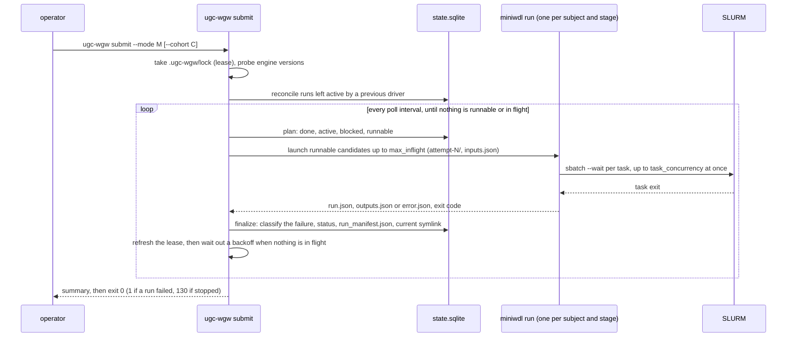
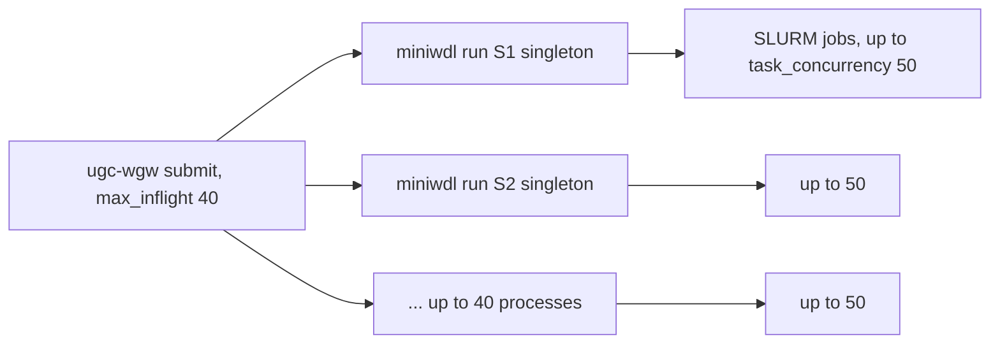
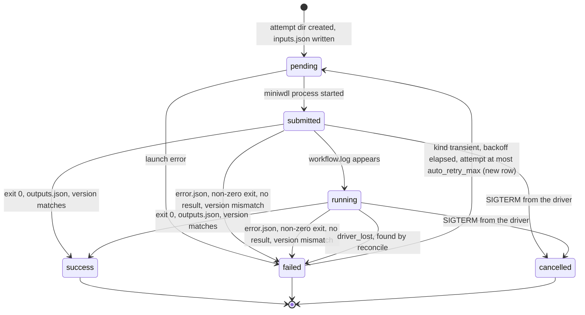
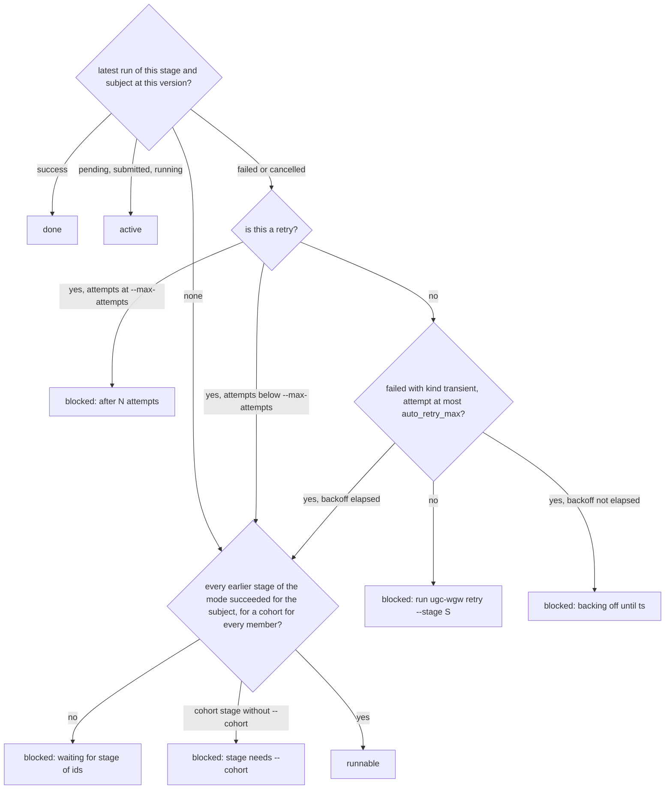

# Running

## Where the driver runs

`ugc-wgw submit` is a foreground loop. It stays alive as long as runs are in
flight and needs to survive your terminal, so run it under `tmux` on a login
node, or as a SLURM job on a partition that allows jobs to submit jobs
(`examples/submit.sbatch`). The driver itself is light. Each miniwdl process
it launches is one Python process that waits on `sbatch --wait`; the heavy
work happens in the tasks' own jobs. Only one `submit` or `retry` per project
can run at a time, and a session walks one mode; to run assembly beside the
variant stages, use a second project (chapter 03).

```bash
tmux new -s cohort2026
cd /proj/ugc/projects/cohort2026
ugc-wgw -v submit --mode standalone --cohort C1 --max-inflight 40 --poll-interval 60
```

## What `submit` does



In words: the driver takes the project lock, records the miniwdl,
miniwdl-slurm and Apptainer versions for the manifests, settles any run a
previous driver left active, then loops. Each iteration recomputes the whole
plan from the database, launches what is runnable until `--max-inflight`
processes are in flight, sleeps for the poll interval (waking early when a
child exits), and finalises every finished child: classifies a failure,
writes `run_manifest.json`, records the status, repoints `current`. It
refreshes the project lease on every iteration. When nothing is in flight
but a subject is backing off after a transient failure, it waits for that
moment instead of exiting. It stops when nothing is runnable and nothing is
in flight, prints a summary listing every blocked subject with its reason and
every run still active elsewhere, and exits.

## Concurrency



The SLURM pressure of one project is `max_inflight × task_concurrency` jobs,
the second number coming from the site file at install time. A `singleton`
run has a few dozen tasks, most of them short; DeepVariant's eight
`make_examples` shards and pbmm2's chunks run in parallel within one run. With
`task_concurrency = 50`, one run rarely holds more than 10 to 20 jobs at once,
so 40 runs in flight means several hundred jobs. Choose `--max-inflight` from
the partition's limits and the storage's appetite for concurrent 30 GB BAM
writes, not from CPU counts.

## Selecting work

| Selector | Effect |
|---|---|
| `--mode M` | The stage sequence (default `standalone`). |
| `--stage S` | Only this stage of the mode; the others are still consulted for prerequisites. Required for `retry`. |
| `--samples ID ...` or `--samples-file F` | Only these samples; default all registered samples (or the cohort's members with `--cohort`). |
| `--cohort ID` | The cohort for the cohort stages; also restricts samples to its members. Required from the first stage on in `joint` mode. |
| `--any-version` | Accept a prerequisite that succeeded at an older ugc-wgw version; the manifest records which. |
| `--max-inflight N`, `--poll-interval SEC` | Override the project defaults. |
| `--dry-run` | Compute the plan and print the first wave, change nothing. |
| `--takeover` | Take the project lease from a driver on another host that is known to be dead. |

Without `--cohort` a standalone `submit` runs `singleton` for every selected
sample and reports `cohort_merge needs --cohort <id>` as blocked, which is the
expected way to run per-sample work before the cohort is frozen.

## Dry run

```bash
ugc-wgw submit --mode joint --cohort C1 --dry-run
```

prints the resource summary (caps and policy rows, chapter 12), a header
with the counts, then for each runnable candidate of the first wave the
attempt directory, the generated inputs JSON and the exact `miniwdl run`
command line, then the blocked list with reasons and the active list. It
also reconciles first, so the lists reflect what a real `submit` would see.
Use it to check overrides, paths and the plan before committing a cluster to a
cohort.

```
# resources: cpu_max=48 memory_max=375G policy=/proj/ugc/resources.tsv (2 rows) deepvariant=cpu
# ugc-wgw dry-run: mode=joint version=0.2.0 runnable=3 blocked=1 active=0 done=0

## sample S1 / upstream -> /proj/ugc/results/c26/samples/S1/0.2.0/upstream/attempt-1
{ "ugc_wgw_upstream.hifi_reads": [...], ... }
miniwdl run /proj/ugc/versions/0.2.0/code/workflows/ugc_wgw_upstream.wdl -i .../inputs.json \
    --dir .../attempt-1/. -o run.json --cfg /proj/ugc/versions/0.2.0/miniwdl.cfg --no-color --log-json
...
# blocked: cohort C1 / cohort_call: waiting for upstream of S1, S2, S3
```

## Watching

`ugc-wgw status --mode M [--cohort ID] [--failed] [--json]` prints one row per
sample with one column per sample stage of the mode, and a row for the cohort
when the mode has cohort stages. A cell is the status of the latest attempt at
the current version, with the attempt number in parentheses when it is not the
first: `success`, `failed(2)`, `running`, `-` for never run. `--failed` keeps
only rows with a failed or cancelled cell and adds two columns, the failure
`kind` and `message` of the first such cell; `--json` always includes them.

```
subject   type    singleton   cohort_merge  cohort_freq
S1        sample  success     
S2        sample  failed(2)   
S3        sample  running     
C1        cohort              -             -
```

`ugc-wgw samples list --mode M [--stage S] [--status failed,running]` is the
same view restricted to samples, with the sex column.

While it runs, the driver logs a progress summary whenever the counts change and
at least every `progress_interval` seconds (300), to `.ugc-wgw/logs/ugc-wgw.log`
and to the terminal with `-v`, and records it as a `submit.progress` event:

```
progress mode=standalone 12/41 (29%) eta≈6h10m
  singleton     done 12/40  active 2 (HG004 21/33 tasks, HG002ds 9/33 tasks)  median 2h05m  eta≈5h40m
  cohort_merge  done 0/1  waiting 1  median –  eta≈–
  cohort_freq   done 0/1  waiting 1  median –  eta≈–
```

Counts are exact: every subject and stage of the selection is done, active,
runnable, waiting for a prerequisite, backing off, or failed (needs retry).
The times are estimates: the median wall time of finished runs of that stage
at this version, times the waves left at the current concurrency, less the
share of tasks the active attempts have already finished (from
`workflow.log.json`, against the task count of a completed run). There is no
estimate before the first run of a stage has finished, and a stage that
replays from the call cache finishes far sooner than its median. The same
summary is available from another terminal: `ugc-wgw progress --mode M
[--cohort ID] [--samples ...] [--json]`.

`ugc-wgw logs <subject> --stage S [--attempt N] [--tail N] [--follow] [--json]`
prints a two-line header (run ID, status, attempt, directory, then the log
path) followed by the run's `workflow.log`, or `miniwdl.stderr` when miniwdl
did not get as far as writing a log. `workflow.log` is plain text;
`workflow.log.json` (`--json`) is the same log as JSON lines. `--follow`
keeps printing until the run ends, then prints its final status, error
class, kind and message. Each task's own stdout, stderr and SLURM submission
log are under the run directory's `call-<task>/` subdirectory until
`delete_work` reclaims a successful run (chapter 09).

Every command that reads run state (`status`, `samples list`, `--dry-run`)
first reconciles runs that the database still calls active but whose driver
is gone, so a crashed driver's runs are settled as soon as anyone looks.

## Run states



Text version:

```
pending ──► submitted ──► running ──► success     (exit 0, outputs.json, version echo matches)
   │            │            ├──────► failed      (error.json / non-zero exit / no result /
   │            │            │                     version_mismatch / driver_lost)
   │            └────────────┴──────► cancelled   (SIGTERM from the driver: Ctrl-C, scancel)
   └──────────────────────────────► failed        (launch_error)
failed (kind transient, attempt ≤ auto_retry_max) ──backoff──► pending   (new row, attempt N+1)
Terminal rows never change. `ugc-wgw retry` inserts a new row: attempt N+1.
```

Every failure gets a **kind**: `transient` (a dead driver, a signal, node
failure or preemption), `resource` (exit status 137 or 253, or `oom_kill`,
`OUT_OF_MEMORY`, `DUE TO TIME LIMIT` in the task's SLURM log), `input`
(input errors, missing files), `tool` (any other command failure),
`version`, `cancelled`, `unknown`. The kind, a short message and the log
line that decided it are stored with the run, written into the manifest and
shown by `ugc-wgw status --failed`. Only `transient` failures are re-attempted
by the driver itself: after `backoff_seconds` (300) doubling with every
attempt, while the attempt number is at most `auto_retry_max` (2). Chapter
09 has the full rule table.

How the driver reads a finished miniwdl process, in order: `run.json` with
`outputs` and an existing `outputs.json` and exit 0 is success; `run.json` with
`error`, or an `error.json`, is a failure with the error class and message taken
from the innermost cause; a non-zero exit with none of those is `NoResult`. A
successful run whose `ugc_wgw_workflow_version` output differs from the driver's
version is forced to `failed` with class `version_mismatch`.

## How the plan classifies a subject



Text version:

```
latest run at this version?  success ─────────────────────────────► done
                             pending/submitted/running ────────────► active
                             failed, transient, attempt ≤ auto_retry_max, backoff pending ► blocked: "backing off until <ts> after transient <class>"
                             failed, transient, attempt ≤ auto_retry_max, backoff elapsed ─┐  (runnable: auto-retry)
                             failed/cancelled otherwise, not a retry ► blocked: "failed (attempt 2, <class>, <kind>); run `ugc-wgw retry --stage S`"
                             failed/cancelled, retry at cap ───────► blocked: "failed after 3 attempts (max 3)"
                             none, or retry below cap ─────────────┤
prerequisites (every earlier stage of the mode; for a cohort: every member)
                             missing ──────────────────────────────► blocked: "waiting for upstream of S1, S2 (+N more)"
                             cohort stage without --cohort ────────► blocked: "cohort_merge needs --cohort <id>"
                             met ──────────────────────────────────► runnable
```

Blocked is bookkeeping only; nothing is written for a blocked subject. Each
distinct reason is reported once per `submit` session and again in the final
summary. A candidate whose inputs cannot be generated (an earlier stage's
output is missing from `outputs.json`) is reported as blocked with the member
and output name, and skipped.

## Retrying

```bash
ugc-wgw retry --mode standalone --stage singleton              # every failed/cancelled singleton run
ugc-wgw retry --mode standalone --stage singleton --samples S2 # one sample
ugc-wgw retry --mode joint --cohort C1 --stage cohort_call
```

`retry` is `submit` with two differences: `--stage` is required, and failed or
cancelled subjects of that stage become runnable again as a new attempt
whatever their kind and backoff, up to `--max-attempts` (default 3, counted
over all attempts of that stage and version). Plain `submit` re-runs only
transient failures, automatically and after their backoff. A retry re-uses every
task of the previous attempt that completed, through the call cache, so a run
that failed in its last task repeats only that task. Fix the cause first
(chapter 09); a retry with the same inputs and the same error class is a
retry wasted.

## Stopping

Ctrl-C in the terminal, or `scancel` of the driver's job, sends the driver
SIGINT or SIGTERM. It prints `[ugc-wgw] signal N: stopping (terminating K
run(s), grace 120s)`, launches nothing more, forwards SIGTERM to every miniwdl
child's process group (so miniwdl cancels its SLURM steps), waits up to two
minutes, kills survivors, marks every child `cancelled`, writes their manifests,
runs `scancel` on the SLURM jobs of a child it had to kill (miniwdl cancels its
own jobs only on a clean stop) and exits 130. Cancelled runs block their subject
like failed ones; `ugc-wgw retry --stage S` starts them again, from the call
cache.

## Exit codes and the lock

| Exit | Meaning |
|---|---|
| `0` | Nothing left to do and no subject's latest attempt failed in this session (a subject recovered by an automatic retry counts as success). |
| `1` | A `[ugc-wgw] error: ...` was printed, or at least one subject's latest attempt failed in this session. |
| `130` | Stopped by a signal; children cancelled. |

`.ugc-wgw/lock` holds the driver's lease, one line: `pid=... host=... since=...
last_seen=...`, with `last_seen` rewritten on every poll. On the same host
the file is also flock-ed, so a second `submit` or `retry` prints `another
ugc-wgw submit/retry holds <path> (...)` and exits 1; if the holder died, the
flock died with it and nothing needs cleaning up. From another host the
flock cannot be trusted, so the lease decides: a `submit` refuses while
`last_seen` is younger than `lease_seconds` (900 by default) and takes over an
older lease with a warning. `--takeover` takes a fresh lease when you know the
holder is dead; a holder that is still alive notices on its next heartbeat and
stops itself. Read-only commands never take the lock. One project, one driver;
the state database is SQLite and must not live on plain NFS.

## After a driver crash

Runs that the database still calls active are settled by the next command
that looks at run state:

- If the run directory has a result (`run.json`, `outputs.json` or
  `error.json`), the run is finalised from it; `finished_at` is the file's
  modification time.
- If there is no result and the recorded driver PID is dead on this host, the
  run becomes `failed` with class `driver_lost` and kind `transient`; the
  SLURM jobs its miniwdl had submitted are cancelled with `scancel` (their
  ids come from the task directories), and the next `submit` re-attempts the
  subject after the backoff.
- If the run was recorded on another host, the lease decides: it is settled
  the same way when that host's lease has expired or this process now holds
  the lease (`--takeover`), and left alone with a warning while the other
  driver's lease is fresh.

## Versions and `--any-version`

The plan looks up "already done" at the current version only, so a new
version re-runs every stage. `--any-version` relaxes the prerequisite lookup
and the input generation: a `cohort_merge` at a later version may take the
`singleton` outputs produced at an earlier one, and the manifest's
`cohort_members` lists the version and run ID used for each member. Chapter
10 discusses when that is appropriate (never across a reference change such
as 0.1.0 to 0.2.0).
