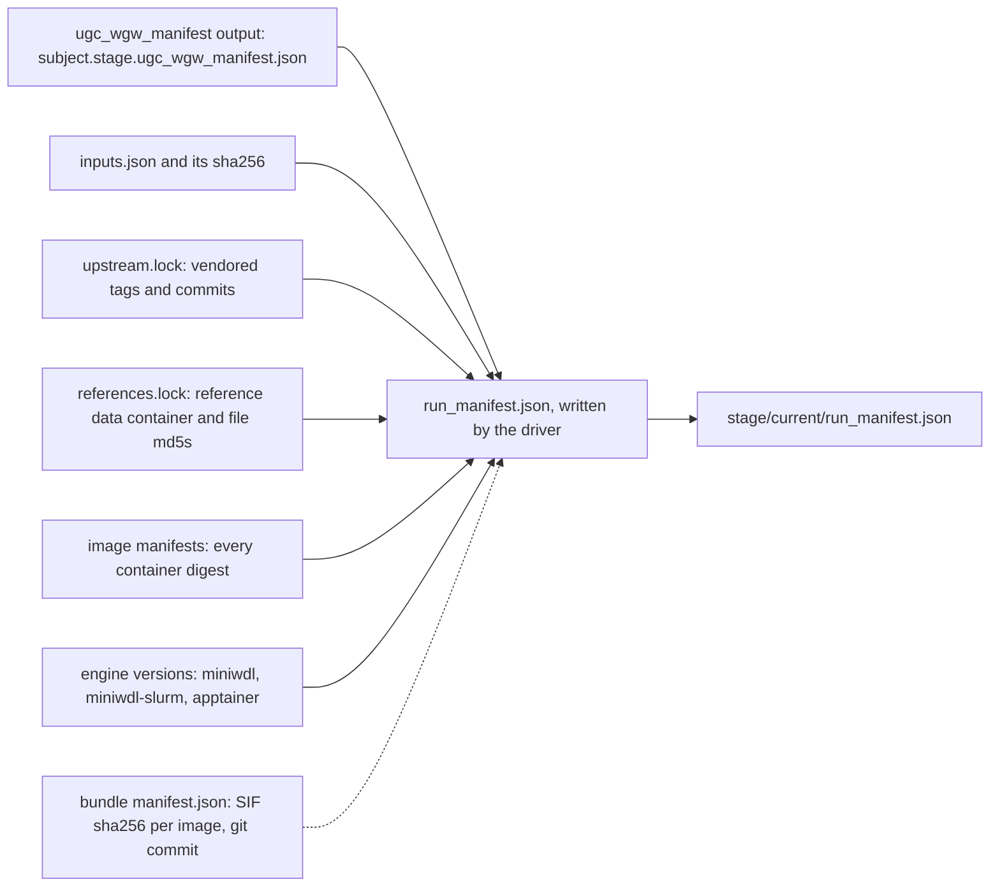

# Results

## The results tree

```
<results>/
├── samples/<sample_id>/<v>/<stage>/
│   ├── attempt-1/
│   │   ├── inputs.json        driver, before launch; its sha256 is in the manifest
│   │   ├── miniwdl.stdout     miniwdl's stdout (usually empty)
│   │   ├── miniwdl.stderr     miniwdl's stderr; the only log when it fails before workflow.log
│   │   ├── workflow.log       miniwdl, plain text; its appearance means "running"
│   │   ├── workflow.log.json  the same log as JSON lines
│   │   ├── run.json           miniwdl, at the end: {"outputs": ...} or {"error": ...}
│   │   ├── outputs.json       miniwdl, on success: output name -> path under out/
│   │   ├── error.json         miniwdl, on failure
│   │   ├── out/               miniwdl, on success: one directory per output, hardlinks
│   │   ├── call-<task>/       miniwdl work dirs; removed on success (delete_work), kept on failure;
│   │   │                      slurm_singularity.log.txt holds the SLURM job id and slurmd's messages
│   │   └── run_manifest.json  driver, on every finished attempt
│   ├── attempt-2/             a retry
│   └── current -> attempt-2   the latest finished attempt, whatever its status
└── cohorts/<cohort_id>/<v>/<stage>/   same shape
```

`<v>` is the ugc-pacbio-wgw version that produced the attempt. A cohort
assembled over years contains samples processed by different releases, and
the path says which.

## `outputs.json` and `out/`

`outputs.json` maps every workflow output, namespaced `ugc_wgw_<stage>.<name>`,
to a path. Files live under `out/<name>/<basename>`; array outputs under
`out/<name>/<i>/<basename>` in array order. Two ways to find a file:

```bash
python3 -c 'import json,sys; print(json.load(open(sys.argv[1]))["ugc_wgw_singleton.phased_small_variant_vcf"])' \
    samples/HG002/0.2.0/singleton/current/outputs.json
ls samples/HG002/0.2.0/singleton/current/out/phased_small_variant_vcf/
```

The output names are upstream's; the tables below give the ones analysts
ask for.

## What to look at, per stage

Per-sample files are named `<sample_id>.GRCh38_GIABv3.<what>`; the reference
name comes from the map (`name`). Cohort files are named
`<cohort_id>.joint.GRCh38_GIABv3.<what>` (`cohort_call`),
`<cohort_id>.merged.GRCh38_GIABv3.<what>` (`cohort_merge`) and
`<cohort_id>.freq.GRCh38_GIABv3.<what>` (`cohort_freq`).

### `singleton` (standalone) and `downstream` (joint)

| Output | What it is |
|---|---|
| `merged_haplotagged_bam`, `_index` | HiPhase-haplotagged alignments, the BAM to load in a browser. |
| `phased_small_variant_vcf`, `_index` | Phased DeepVariant (standalone) or cohort-consistent GLnexus (joint) small variants. |
| `phased_sv_vcf`, `_index` | Phased sawfish structural variants. |
| `phased_trgt_vcf` (`trgt_vcf` in `downstream`), `_index`, `trgt_spanning_reads` | Tandem repeat genotypes and the reads spanning them. |
| `small_variant_gvcf`, `_index` (`singleton`) | The gVCF; input to GLnexus in `cohort_merge`. |
| `cpg_pileup_bed`, `hmcpg_pileup_bed` (+ indices), `methbat_profile` | 5mCpG and 5hmCpG methylation per site (MethBat pileup) and per region (MethBat profile). |
| `pbstarphase_summary` (`pbstarphase_json` in `downstream`), `pbstarphase_tsv` | Pharmacogenomic star alleles (StarPhase) and its PharmCAT-style TSV. |
| `kivvi_kiv2_*`, `kivvi_d4z4_*` (`singleton`; in `upstream` for joint) | LPA KIV-2 and DUX4 D4Z4 repeat genotypes. The JSON records `call_status` (`failed_due_to_no_reads` when the region is empty); the allele plots exist only when an allele was called; all six are absent, with a `msg` line, when kivvi fails on low coverage. |
| `paraphase_*`, `mitorsaw_*` (`singleton`; in `upstream` for joint) | Paralog and mitochondrial calls. |
| `phase_stats`, `phase_blocks`, `phase_haplotags` | HiPhase summaries. |
| `small_variant_stats`, `bcftools_roh_*`, `sv_stats_plot`, the pbjam plots (`read_length_plot`, `read_quality_plot`, `mapq_distribution_plot`, `mg_distribution_plot`) | QC. |
| `stats_file` | One TSV with every `stat_*` value of the sample: depth, inferred sex, mapped reads, phasing NG50, variant counts, TRGT and methylation numbers. |
| `msg_file`, `msg` | QC messages, for example an input BAM that was already aligned, or a catalog without fail-reads loci. |

### `upstream` (joint)

| Output | What it is |
|---|---|
| `aligned_hifi_reads`, `_index` | pbmm2 alignments, merged over uBAMs; not haplotagged yet. |
| `aligned_fail_reads`, `_index` | Baited fail reads for TRGT, when fail reads were given. |
| `small_variant_vcf`, `small_variant_gvcf` (+ indices) | DeepVariant per-sample calls and gVCF. |
| `sv_vcf`, `sv_supporting_reads`, `sv_copynum_*`, `sv_depth_bw`, `sv_gc_bias_corrected_depth_bw` | Per-sample sawfish call and CNV tracks (with `run_sawfish_call`). |
| `discover_tar` | sawfish discover directory, for a later multi-sample call. |
| `inferred_sex`, `stat_depth_mean`, `mosdepth_*` | Coverage and the inferred karyotype the driver passes on. |
| `paraphase_*`, `mitorsaw_*` | Paralog and mitochondrial calls. |

### `cohort_call`

| Output | What it is |
|---|---|
| `cohort_small_variant_vcf`, `_index` | The GLnexus multi-sample VCF, `<cohort_id>.joint.GRCh38.small_variants.vcf.gz`. |
| `split_small_variant_vcfs`, `_indices` | One single-sample VCF per member, in cohort order, `<sample_id>.<cohort_id>.joint.GRCh38.small_variants.vcf.gz`; hom-ref records kept by default. |
| `cohort_sv_vcf`, `split_sv_vcfs`, `sv_*` (optional) | Multi-sample sawfish call and its per-sample slices, with `run_sawfish_joint_call`. |

### `cohort_merge`

| Output | What it is |
|---|---|
| `cohort_sv_vcf`, `_index` | Merged structural variants, `<cohort_id>.merged.GRCh38.structural_variants.vcf.gz`; svx merges by breakpoint similarity, bcftools is a site union. |
| `cohort_trgt_vcf`, `_index` | Merged tandem repeat genotypes, `<cohort_id>.merged.GRCh38.trgt.vcf.gz`. |
| `cohort_trgt_lps` | trgt-lps table, `<cohort_id>.merged.GRCh38.trgt.lps.tsv`. |
| `cohort_small_variant_vcf`, `_index` (optional) | Unphased GLnexus VCF from the gVCFs, `<cohort_id>.merged.GRCh38.small_variants.vcf.gz`, standalone mode by default. |
| `cohort_phased_small_variant_vcf`, `_index` (optional) | bcftools merge of the phased per-sample small-variant VCFs. |

### `cohort_freq`

| Output | What it is |
|---|---|
| `small_variant_freq_vcf`, `_index` (absent without a joint VCF) | Sites-only allele counts of the cohort's GLnexus VCF, `<cohort_id>.freq.GRCh38.small_variants.vcf.gz`: `AC`, `AN`, `AF`, `NS`, `AC_Hom`, `AC_Het`, `AC_Hemi` overall and `_XX`/`_XY`; no genotypes. |
| `sv_freq_vcf`, `_index` | The same over the merged SV VCF, `<cohort_id>.freq.GRCh38.structural_variants.vcf.gz`, plus `SUPP` (carrier samples) and `CF` (carrier frequency). |
| `freq_summary` | `<cohort_id>.freq.GRCh38.summary.tsv`: records by type, contig class, filter and AF bin; singletons; call rate; strata. Long format, `resource metric key value`. |
| `freq_samples` | `<cohort_id>.freq.GRCh38.samples.tsv`: each member's sex group, where it came from, and presence in each VCF. |

The `##ugc_wgw_cohort_freq_*` header lines of both VCFs say how the counts were
made (chapter 08).

### `assembly`

| Output | What it is |
|---|---|
| `haplotypes` | `["hap1", "hap2"]`: the order of every per-haplotype array below. hap1 is the father's, hap2 the mother's haplotype in trio mode. |
| `zipped_assembly_fastas`, `assembly_stats` | Contigs per haplotype, `<sample_id>.asm.<bp\|dip>.<hap>.p_ctg.fasta.gz`, with calN50 statistics. `dip` means trio-binned, `bp` HiFi-only. |
| `assembly_noseq_gfas`, `assembly_lowQ_beds` | Assembly graphs without sequence and low-quality regions. |
| `asm_bams`, `asm_bam_indices`, `merged_asm_bam` | Contigs aligned to GRCh38 per haplotype, and both merged: `<sample_id>.asm.GRCh38.bam`. |
| `paftools_vcfs`, `paftools_vcf_indices`, `paftools_vcf_stats` | Variants called from the contig alignments per haplotype. |
| `trio`, `hap1_parent`, `hap2_parent` | Whether trio binning was used and which parent each haplotype follows. |

## The stats and message files

`stats_file` (`<sample_id>.GRCh38.stats.txt`) is a two-column TSV of every
statistic the run computed, the same table upstream's singleton writes; it is
the file to aggregate across a cohort for QC. `msg_file` holds the QC messages
of the run, for example `Reported sex (MALE) does not match inferred sex
(FEMALE)`; in joint mode `downstream` prepends the `upstream` messages so the
file matches what `singleton` would have written.

## `run_manifest.json`

Written by the driver in every finished attempt directory, on success and on
failure. `<stage>/current/run_manifest.json` is the record to cite.

| Field | Content |
|---|---|
| `schema` | `1`. |
| `ugc_pacbio_wgw` | `version` and the `git_commit` of the installed code (on the HPC from the bundle's `manifest.json`, since the installed code is not a git checkout). |
| `upstream` | The `sources` section of `upstream.lock`: vendored repositories, tags, commits. |
| `references` | The `bundles` section of `references.lock`: the reference data container (build, digest, file md5s) and ugc-wgw-extras. |
| `engine` | `miniwdl`, `miniwdl_slurm` and `apptainer` versions as probed by the driver. Empty when the run was finalised by a read-only command after a driver crash. |
| `stage`, `mode`, `subject` | What ran: `subject` is `{"type": "sample" or "cohort", "id": ...}`. |
| `cohort_members` | For a cohort stage (and for a trio assembly): per member, the stage, ugc-wgw version and run ID whose outputs were used. |
| `inputs_file`, `inputs_sha256` | The attempt's `inputs.json` and its checksum. |
| `containers`, `containers_source` | Every image digest of the installed code (upstream's and ugc-wgw's image manifests, union). The per-task mapping is not recorded in phase 1. |
| `run_id`, `run_dir`, `attempt`, `status`, `exit_code` | The attempt and how it ended. |
| `started_at`, `finished_at`, `host`, `slurm_job_ids` | Timestamps in UTC; the SLURM job ids of every task that was submitted (read from the task directories; empty without SLURM). |
| `resource_policy` | The site resource policy at launch, `path` and `sha256` (chapter 12); `null` when the install has none. |
| `error` | Only when the status is not `success`: `class`, `kind`, `message`, `engine_message`, `exit_code`, `exit_status`, `task_dir`, `node`, `evidence` (the log file and line that decided the kind), `not_before` (earliest automatic re-attempt). |
| `ugc_wgw_manifest` | Only on success: the workflow's own manifest, embedded (below). |

The embedded workflow manifest, `<subject>.<stage>.ugc_wgw_manifest.json`, is
written by the `ugc_wgw_manifest_write` task inside the run: `schema`,
`ugc_wgw_version`, `stage`, `subject`, `cohort_members` (plain ID list),
`upstream` (`workflow_name`, `workflow_version`, for example
`humanwgs_singleton` `4.0.0`), `written_at`, `host`.



The bundle's own `manifest.json` under `<prefix>/versions/<v>/` closes the
chain: it pins the sha256 of every SIF and the git commit the code was
archived from, so a run manifest's `git_commit` and image digests can be
traced to the exact files that were on the HPC.

## Run report

`ugc-wgw report [--mode M] [--cohort ID] [--any-version] [--sizes] [--out FILE]`
writes one self-contained HTML file (inline styles and charts, nothing
fetched from the network, so it opens anywhere) summarising the project's
runs. It is a technical summary of how the campaign ran, not of what it
found. Sections:

- Cards: samples, cohorts, runs by status, automatic retries, tasks and
  call-cache hits, summed run time and campaign span.
- Provenance: ugc-pacbio-wgw version and commit, upstream tags, reference
  bundle, engine versions, hosts.
- Stages: per stage the runs, subjects done, statuses, re-attempts, median,
  mean, max and total wall time, tasks and cache hits.
- Timeline: one bar per attempt, coloured by status, on a shared time axis.
- Concurrency: runs and tasks in flight over time, with the peaks.
- Progress over time: the driver's `submit.progress` samples (done fraction
  and the estimate it gave at the time).
- Slowest tasks and a per-task table: calls, cache hits, miniwdl-level
  retries, failures, median, mean, max and total wall time, and cpu requests
  that miniwdl rounded down to the host.
- Runs: every attempt with its kind, duration, exit code, task count, SLURM
  job count, optional `out/` size (`--sizes` walks the results tree) and a
  link to its manifest.
- Failures: kind, class, node, exit status, the evidence line and the task
  directory, and when the driver will re-attempt.
- resource adjustments (site caps and policy rows per task, chapter 12),
  driver sessions, and the notable events
  (reconciliations, cancellations, automatic retries, warnings, errors).

Task timings come from `workflow.log.json`, which miniwdl writes for the
whole run, so they survive `delete_work`. The default output is
`<results>/reports/ugc-wgw-report-<timestamp>.html`; the path is printed.

## Analysis summary

`ugc-wgw summary [--samples ID... | --samples-file F] [--cohort ID] [--mode M]
[--any-version] [--out-dir DIR] [--force] [--threshold KEY=VALUE ...]
[--jobs N]` writes what the analysis found, as self-contained HTML (inline
styles, inline SVG charts, nothing fetched from the network), one page per
sample and one per cohort, under `<results>/reports/summary/`
(`<id>.summary.html`). It summarises the latest successful runs of the
mode: `singleton` in standalone mode, `upstream` and `downstream` in joint
mode, plus the sample's `assembly` when it ran. Without `--samples` or
`--cohort` every registered sample is summarised; `--cohort` adds the
cohort page and covers the cohort's members. The paths written are
printed, one per line.

The sample page has a fixed menu on the left and these sections: overview
with the QC flags; reads; coverage (mean depth per chromosome, the
chrX/chrY ratios behind the sex inference, depth along the genome in 1 Mb
bins with sawfish's copy-number segments); small variants (counts, Ts/Tv,
het/hom, substitution spectrum, indel lengths, site quality and depth
histograms, runs of homozygosity); structural variants by type and size;
phasing; tandem repeats (coverage dropouts and the catalog's known disease
loci with their genotypes); methylation; the targeted callers (Paraphase,
mitorsaw, StarPhase, kivvi); the workflow messages and the files read;
software and workflow (tool versions as pinned in the WDL, engine versions,
ugc-wgw and upstream commits, the reference build and its checksums, citations,
the project URL).

The cohort page lists the members with their QC status (each row links to
the sample page), draws every metric across the members (median,
interquartile box, outliers beyond median ± 3 MAD in red, QC thresholds as
dashed lines), checks sex consistency, summarises the cohort call sets
(joint VCF, merged SVs with the support histogram, trgt-lps), the
`cohort_freq` summary (allele-frequency bins, singletons, call rate, sex
strata) and the assemblies.

QC flags are advisory checks by the driver, not the workflow's:
`low_depth` (`depth_mean_min`, 20x), `low_mapped`
(`mapped_read_percent_min`, 95 %) and `low_read_quality`
(`read_quality_median_min`, 25) fail the sample; `sex_mismatch` (sheet
versus coverage), `sex_not_inferred` and `tool_status` (kivvi without
reads, Paraphase regions failed for coverage, mitorsaw without haplotypes)
warn; workflow messages are informational. Thresholds come from
`summary_thresholds` in `config.json` or `--threshold KEY=VALUE`; unknown
keys are refused. Flags are re-evaluated whenever a page is written, so a
changed threshold needs no rebuild.

Each sample's numbers are also written as `<sample>.summary.json`, a digest
the cohort page reads instead of the sample's files, so a cohort of a
thousand samples renders from a thousand small JSON files. A digest is
reused while the runs it came from are unchanged and rebuilt otherwise
(`--force` rebuilds all). Building one costs about 15 s of pure Python per
sample (the 500 bp mosdepth bed and the TRGT outputs are streamed);
`--jobs N` builds N in parallel. Set `project_url` in `config.json` to the
repository the pages should link to.

## The driver's logs

`.ugc-wgw/logs/ugc-wgw.log` is the human log (UTC timestamps).
`.ugc-wgw/logs/events.jsonl` has one JSON object per line, `{"ts", "run_id",
"level", "event", "detail"}`, also stored in the `events` table of the database.
Events: `sample.added`, `sample.warning`, `cohort.frozen`, `submit.start`,
`submit.stop`, `sample.removed`, `run.created`, `run.submitted` (with the
command line), `run.running`, `run.blocked`, `run.auto_retry`,
`run.terminating`, `run.success`, `run.failed`, `run.cancelled` (each with the
kind, message, task directory, node and SLURM job ids), `run.reconciled`,
`run.scancel`. The sequence of a clean run is `created`, `submitted`, `running`,
`success`.
