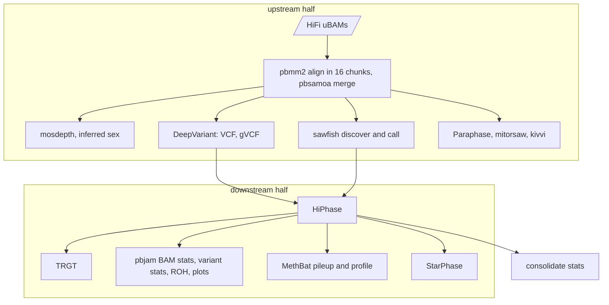
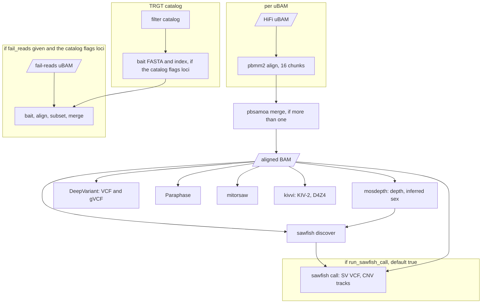
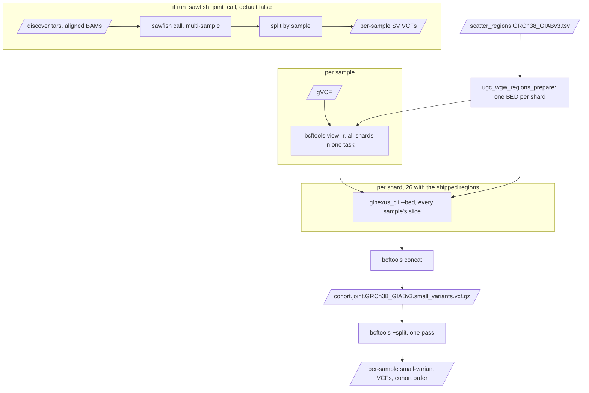
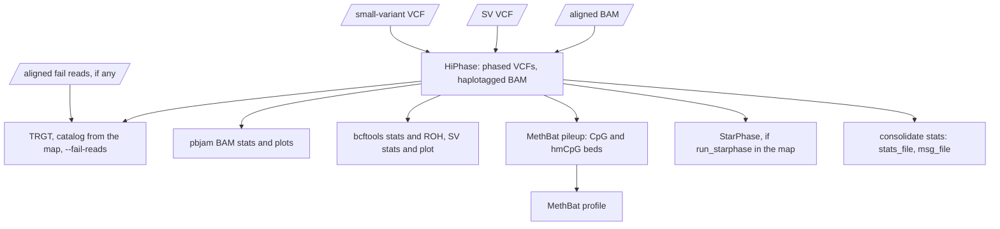
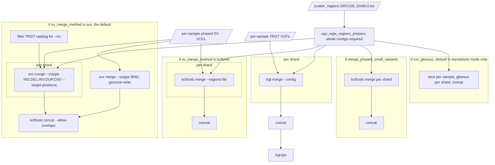
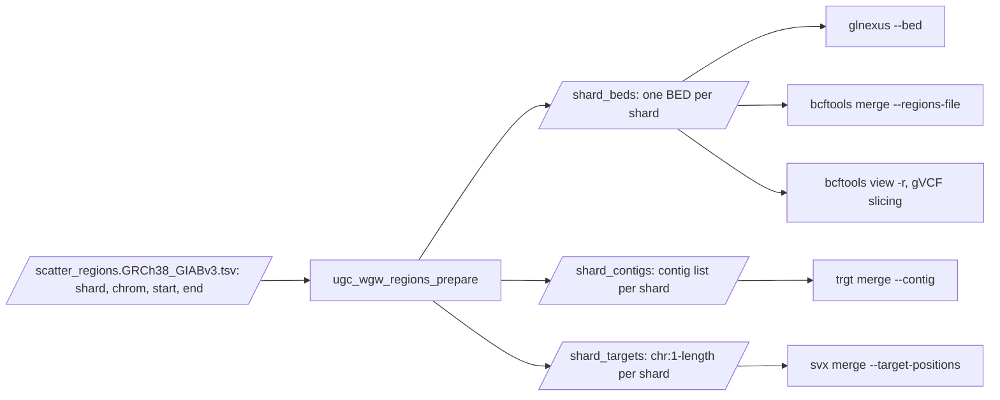
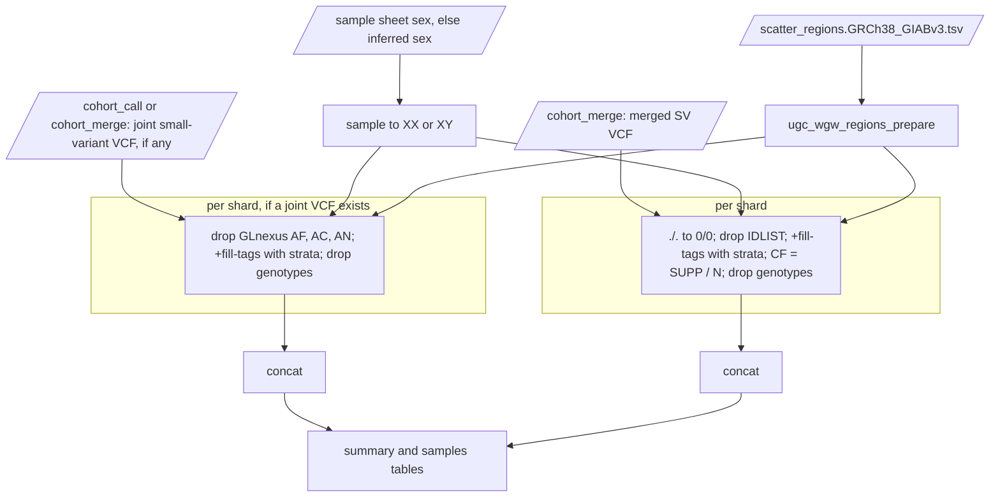
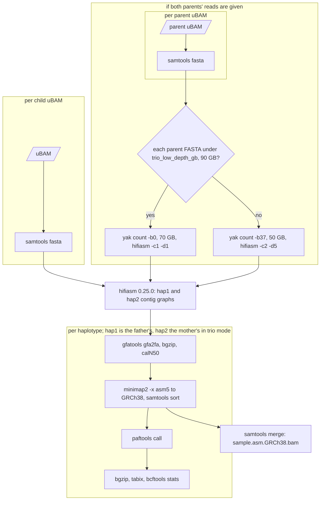

# Stages

For each stage: what it runs, which inputs the driver fills and which you may
override through `stage_inputs`, the switches, the resources, and where the
outputs are described. The diagrams are simplified; the exact call graphs are
in [workflow-graphs.md](workflow-graphs.md). Upstream documents its tools in
`vendor/hifi-human-wgs-wdl/docs/` (`pbmm2.md`, `deepvariant.md`, `trgt.md`,
`kivvi.md`, `methbat.md`, `gpu.md`).

Every stage takes `ugc_wgw_version` (echoed back and checked), `ref_map_file`
(the one rendered map, chapter 04), `backend` (`HPC`) and `preemptible` from
the driver; `cohort_merge` and `assembly` also take `ugc_wgw_container_registry`
for the images this repository builds.
Per-sample resource requests are upstream's own and unchanged: every task's
request is in the generated [inventory](task-resources.md), and chapter 12
shows how a site caps or overrides them. The numbers below are the ones
ugc-pacbio-wgw sets. The N-scaled memory formulas are first estimates until
the cohort smoke test replaces them.

## `singleton`

Upstream's `singleton.wdl`, mirrored call for call (the reference data comes
from the rendered map instead of being unpacked from PacBio's data container
in every run), plus the manifest task. One run does everything `upstream` and
`downstream` do, in one process. Use it in standalone mode.



| Driver fills | You may override |
|---|---|
| `sample_id`, `hifi_reads`, `fail_reads` | `use_alignment_chunking` (true), `use_gpu` (false), `use_parabricks_deepvariant` (false) |

Outputs: the 96 upstream outputs by name plus the two ugc-wgw ones (chapter 07).
Task set: catalog preparation, pbmm2 per BAM (16 chunks), pbsamoa merge,
mosdepth, DeepVariant (8 shards), sawfish discover and call, Paraphase,
mitorsaw, kivvi (KIV-2 and D4Z4), optional fail-reads baiting, HiPhase, TRGT,
pbjam BAM stats, variant stats, MethBat pileup and profile, StarPhase,
consolidate stats. An aligned input BAM is realigned as one chunk, with its
haplotype tags stripped and a message in `msg_file`.

## `upstream`

The pre-phasing half. Same code as inside `singleton`; the split lets the
cohort be joint-called before phasing.



| Driver fills | You may override |
|---|---|
| `sample_id`, `hifi_reads`, `fail_reads` | `run_sawfish_call` (true), `use_alignment_chunking` (true), `use_gpu`, `use_parabricks_deepvariant` |

`run_sawfish_call = true` gives every sample its own SV VCF, so `downstream`
can run without a multi-sample call; set it to `false` only when
`cohort_call` will run `run_sawfish_joint_call`, in which case `upstream`
produces the discover tarball only. Upstream's own default for this flag
(`single_sample`) is `false`; ugc-pacbio-wgw flips it.

Outputs: aligned BAM, optional aligned fail reads, mosdepth and
`inferred_sex`, DeepVariant VCF and gVCF, `discover_tar`, optional per-sample
SV set, Paraphase, mitorsaw, kivvi (the allele plots only when an allele was
called; nothing when kivvi fails on low coverage), `msg` (chapter 07).

## `cohort_call`

GLnexus over the cohort's gVCFs, scattered by region; a per-sample split; an
optional multi-sample sawfish call. Mirrors upstream's `joint.wdl`.



Why the slicing: `glnexus_cli` ignores gVCF indices and reads every gVCF end
to end for each region, so 26 shards over 1000 samples would read 26 000
whole gVCFs. One `bcftools view` per sample cuts all 26 slices index-based,
and each GLnexus shard reads only its slices.

| Driver fills | You may override |
|---|---|
| `cohort_id`, `sample_ids`, `gvcfs`, `gvcf_indices`; with `run_sawfish_joint_call`: `discover_tars`, `aligned_bams`, `aligned_bam_indices` | `split_keep_homref` (true), `run_sawfish_joint_call` (false), `glnexus_threads` (32), `glnexus_mem_gb` (32 + 0.1 N), `split_mem_gb` (8 + 0.02 N), `scatter_regions_file` |

Resources per shard: GLnexus `glnexus_threads` CPUs and `glnexus_mem_gb` GB,
which is also its `--mem-gbytes` budget; the database lives on `$TMPDIR`.
The split runs one bgzip writer per sample. Outputs: cohort VCF, per-sample
split VCFs in cohort order, optional joint SV set (chapter 07).

## `downstream`

The post-phasing half. Mode-agnostic: it phases whatever small-variant and SV
VCF the driver hands it, and needs the inferred `sex` and the aligned BAM
from `upstream`.



| Driver fills | You may override |
|---|---|
| `sample_id`, `sex` (from `upstream.inferred_sex`), `aligned_hifi_reads` (+ index), `aligned_fail_reads` (+ index, when present), `small_variant_vcf` and `sv_vcf` (+ indices; from `cohort_call` slices in joint mode, from `upstream` otherwise), `stat_depth_mean`, `upstream_msg` | nothing beyond the shared inputs |

Outputs: the 62 `downstream` outputs plus `stats_file` and `msg_file`, so
that `upstream` plus `downstream` equals `singleton`.

## `cohort_merge`

Four independent branches after phasing, every one scattered over the shards
of `scatter_regions`: SV merge, TRGT merge with trgt-lps, optional phased
small-variant merge, optional GLnexus.



Why the genome-wide BND job: svx keeps only breakends whose mates are inside
the target positions, so a per-contig shard would silently drop
inter-chromosomal breakends. The BND job runs unscattered and its records are
concatenated with the per-contig results.

| Driver fills | You may override |
|---|---|
| `cohort_id`, `sample_ids`, `sv_vcfs`, `trgt_vcfs` (+ indices; from `singleton` in standalone, from `downstream` in joint), `gvcfs` when `run_glnexus`, `phased_small_variant_vcfs` when `merge_phased_small_variants`, `ugc_wgw_container_registry` | `sv_merge_method` (`svx`), `svx_threads` (8), `svx_min_supp` (1), `svx_mem_gb` (8 + 0.05 N), `trgt_merge_threads` (2), `trgt_merge_mem_gb` (8 + 0.02 N), `trgt_lps_threads` (8), `run_glnexus` (true in standalone, false in joint), `glnexus_threads` (32), `glnexus_mem_gb` (32 + 0.1 N), `merge_phased_small_variants` (false), `bcftools_merge_mem_gb` (8 + 0.02 N) |

Outputs: `<cohort_id>.merged.GRCh38_GIABv3.` SV VCF, TRGT VCF, trgt-lps TSV,
optional phased small-variant VCF and GLnexus VCF (chapter 07).

### Scatter regions



The shipped file has the 25 primary contigs as one shard each and a `rest`
shard holding the 193 other contigs (the 170 unplaced, unlocalised and decoy
contigs of GRCh38 plus the 23 decoys GIABv3 adds), 26 shards in total, so
region-scoped steps see the same contigs as upstream's unscoped ones.
`cohort_merge` requires whole-contig shards because `trgt merge` scopes by
contig only; `cohort_call` accepts finer shards (`scatter_regions_file`),
since GLnexus scopes by BED.

## `cohort_freq`

The last stage of both cohort modes turns the cohort's two multi-sample
VCFs into an in-house frequency resource: sites-only VCFs with allele
counts overall and per sex, a summary and the list of members with the sex
used. Nothing in it is upstream's; the tools are bcftools 1.23 from
`pb_wdl_base`.



Text version: one `ugc_wgw_regions_prepare`; per shard, `ugc_wgw_bcftools_freq`
over the joint small-variant VCF (when there is one) and over the merged SV
VCF; `bcftools concat` of each; `ugc_wgw_freq_summary`; the manifest.

| Driver fills | You may override |
|---|---|
| `cohort_id`, `sample_ids`, `sample_sexes` and `sample_sex_sources` (sheet sex, else the sex `singleton`/`upstream` inferred, else unknown), `sv_vcf` (+ index; from `cohort_merge`), `small_variant_vcf` (+ index; from `cohort_call` in joint mode, from `cohort_merge` with `run_glnexus` in standalone mode; absent otherwise) | `freq_threads` (2), `freq_mem_gb` (4) |

Outputs: `<cohort_id>.freq.GRCh38.` small-variant VCF (only with a joint
VCF), SV VCF, summary TSV, samples TSV (chapter 07). Resources are small:
every task streams one record at a time; the smoke cohort takes ten seconds.

### Reading the counts

- `AC`, `AN`, `AF` per ALT allele as `bcftools +fill-tags` counts them,
  plus `NS` (samples with a call), `AC_Hom`, `AC_Het`, `AC_Hemi`. With
  `_XX` and `_XY` suffixes the same over the members of that sex; a member
  of unknown sex counts in the unsuffixed tags only. Multiallelic records
  stay multiallelic (`Number=A`, one value per ALT); to split them, run
  `bcftools norm -m -any` on the frequency file.
- Small variants: missing genotypes (`./.`, uncovered in GLnexus) are not
  in `AN`, so `AN ≤ 2 · NS` and `AF` is over called alleles. GLnexus's own
  `AF` is replaced; its `AQ` and the `MONOALLELIC` filter are kept.
- SVs: the svx merge marks a sample without the variant in its own sawfish
  call set as `./.`, which is a non-carrier, not a missing call. The stage
  counts those as hom-ref, so `NS = N` and `AN = 2N` on every record and a
  true no-call cannot be told apart. `SUPP` is the number of carrier
  samples, `CF = SUPP / N` the carrier frequency; `AF` counts ALT alleles.
- Half-called genotypes: `AC_Hemi` is not sex-chromosome hemizygosity.
  GLnexus writes `./1` when one allele lacks depth and sawfish encodes
  depth-based CNV carriers as `./1`; the called allele of such a genotype
  counts under `AC_Hemi` with one added to `AN`.
- Sex chromosomes: upstream calls every contig diploid, so an XY sample's
  hemizygous ALT on chrX appears as `AC_Hom_XY` and `AN_XY` is two per XY
  sample there.

The `##ugc_wgw_cohort_freq_*` header lines repeat these conventions in the file
itself, with the cohort, version and source file names.

### Using the files

```bash
# sites with an alternate allele in at most 1 % of alleles among XX members
bcftools view -i 'AF_XX <= 0.01 && AC_XX > 0' C1.freq.GRCh38_GIABv3.small_variants.vcf.gz

# annotate a sample VCF with the cohort frequency
bcftools annotate -a C1.freq.GRCh38_GIABv3.small_variants.vcf.gz -c INFO/AF,INFO/AC,INFO/AN \
    --rename-annots <(printf 'INFO/AF\tUGC_AF\nINFO/AC\tUGC_AC\nINFO/AN\tUGC_AN\n') sample.vcf.gz

# SVs carried by at least a tenth of the cohort
bcftools view -i 'CF >= 0.1' C1.freq.GRCh38_GIABv3.structural_variants.vcf.gz
```

Counts from cohorts that share no samples can be summed (`AC`, `AN`, `NS`
per record); a driver command for that is not written yet. Sample names of
fewer than three characters cannot be stratified by sex (a limit of
`bcftools +fill-tags --samples-file`); the stage fails and names them.

## `assembly`

hifiasm per sample, trio-binned with the parents' reads when the pedigree
allows, then each haplotype converted, aligned and called. Ported from
PacBio's HiFi-human-assembly-WDL v1.0.2.



| Driver fills | You may override |
|---|---|
| `sample_id`, `hifi_reads`; in trio mode `father_id`, `mother_id`, `father_hifi_reads`, `mother_hifi_reads` | `hifiasm_extra_params`, `hifiasm_threads` (48), `hifiasm_mem_gb` (288), `yak_threads` (24), `yak_mem_gb`, `yak_params`, `hifiasm_trio_params`, `trio_low_depth_gb` (90) |

Resources: hifiasm 48 CPUs and 288 GB for up to a day at 30x (about 135 GB
observed); yak 24 CPUs and 70 or 50 GB per parent; minimap2 16 CPUs and
128 GB per haplotype; paftools 4 CPUs and 32 GB. The site's default wall time
of three days covers hifiasm. The yak tables are not exported; the call cache
re-uses them for siblings.

Outputs: per-haplotype FASTAs and statistics, graphs, per-haplotype and
merged alignments, paftools VCFs, `trio`, `hap1_parent`, `hap2_parent`
(chapter 07). The `haplotypes` output gives the order of every per-haplotype
array.
