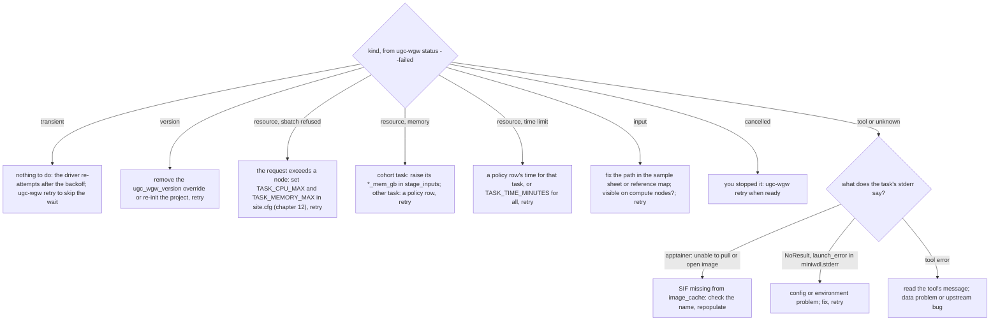

# Troubleshooting

## Where to look, in order

1. `ugc-wgw status --mode M --failed` names the subject, stage, attempt, the
   failure kind and a one-line message with the failed task.
2. `ugc-wgw logs <subject> --stage S --tail 100` prints the run's `workflow.log`
   (plain text; the last lines name the failed task and its exit status) or
   `miniwdl.stderr` when miniwdl stopped before writing a log. `--follow`
   tails a running attempt; `--json` shows the JSON-lines twin.
3. `current/error.json` in the attempt directory has the error class, the
   message and a `cause` chain down to the task.
4. The failed task's work directory, `current/call-<task>/` (or
   `call-<workflow>/call-<task>/` for a task inside a subworkflow): `stderr.txt`
   and `stdout.txt` are the tool's own output; `command` is the script that
   ran. Failed runs keep their work directories; successful ones are reclaimed.
5. The task's `slurm_singularity.log.txt`: the job id on the first line and
   slurmd's messages (`DUE TO TIME LIMIT`, `oom_kill`) below it; the ids are
   also in the manifest's `slurm_job_ids`. `sacct -j <id>` shows
   `OUT_OF_MEMORY` or `TIMEOUT`.
6. `.ugc-wgw/logs/ugc-wgw.log` for what the driver itself did and decided.

## Failure kinds

Every failure is reduced to a kind, in this order of rules; the first match
wins. The kind decides whether the driver re-attempts on its own.

| Kind | Rule | What happens |
|---|---|---|
| `version` | class `version_mismatch` | Blocked until fixed. |
| `transient` | class `driver_lost`, `Interrupted`, `Terminated`, `launch_error`, `killed`, `NoResult`; or `DUE TO PREEMPTION`, `NODE_FAIL`, `Socket timed out`, `Unable to contact slurm controller` in the task's SLURM log | Re-attempted automatically after the backoff, up to `auto_retry_max` times. |
| `input` | class `InputError`, `DownloadFailed`; or a failed command whose logs say `No such file or directory`, `does not exist`, `Permission denied` | Blocked until the path is fixed and `ugc-wgw retry`. |
| `resource` | exit status 137 or 253; `oom_kill`, `OUT_OF_MEMORY`, `Out of memory`, `DUE TO TIME LIMIT`, `TIMEOUT` in the task's SLURM log or stderr; or `sbatch` refused the request (`Requested node configuration is not available`, `CPU count per node can not be satisfied`) | Blocked; cap or change the request (chapter 12), then `ugc-wgw retry`. |
| `tool` | any other `CommandFailed`, `OutputError` or class | Blocked until `ugc-wgw retry`. |
| `cancelled` | the driver stopped the run | Blocked until `ugc-wgw retry`. |
| `unknown` | no error class | Blocked until `ugc-wgw retry`. |

A mislabelled kind costs nothing but a label: only `transient` triggers
compute. `auto_retry_max = 0` in `config.json` disables automatic retries.

## Error classes

The class is in `error.json`, in the manifest's `error` field and in the
blocked reason `ugc-wgw status` shows. The first four come from the driver, the
rest from miniwdl.

| Class | Meaning | Do |
|---|---|---|
| `driver_lost` | The driver died (SIGKILL, node crash, or its lease expired on another host) and the run had no result when reconciliation ran. Its miniwdl process died with it; the SLURM jobs it had submitted are cancelled by the driver (`run.scancel`). | Nothing: the next `submit` re-attempts it after the backoff (kind `transient`). |
| `version_mismatch` | The workflow echoed a `ugc_wgw_workflow_version` different from the driver's `VERSION`. Happens when the code directory changed under a project, or `ugc_wgw_version` was overridden in `stage_inputs`. | Remove the override or re-initialise the project against the intended install; retry. |
| `NoResult` | miniwdl exited non-zero without `run.json`, `outputs.json` or `error.json`. Usually a crash before the workflow started: bad config, missing `miniwdl.cfg`, Python error. | Read `miniwdl.stderr`; fix; retry. |
| `launch_error`, `killed` | The driver could not start miniwdl, or had to SIGKILL it after the stop grace period. | Check `miniwdl.stderr` or the driver log; retry. |
| `CommandFailed` | A task's command exited non-zero. The message names the task and its exit status; `stderr.txt` in the work directory says why. | See the table below. |
| Input or output errors (`InputError`, `OutputError` and similar) | A path in `inputs.json` does not exist or is not readable, or a task did not produce a declared output. | Fix the sample sheet path (`ugc-wgw samples add --replace`) or the reference maps; retry. An output error inside upstream code is a bug to report with the log. |
| `Interrupted` or `Terminated` | miniwdl was signalled: the driver was stopped. | `ugc-wgw retry --stage S`. |

## Playbook



## Cores, memory and wall time

Per-sample tasks request what upstream requests; the cohort tasks request the
N-scaled amounts listed in chapter 08; the whole list is the generated
inventory (`task-resources.md`). Three fixes, in the order to try them:

- `sbatch` refused the job (`Requested node configuration is not
  available`): a task asked for more cores or memory than a node has. Set
  `TASK_CPU_MAX` and `TASK_MEMORY_MAX` in the site file to the node shape
  and reinstall, or add `cpu_max = 48` under `[task_runtime]` in the
  version's `miniwdl.cfg` for an immediate fix; then `ugc-wgw retry`.
- A cohort task was killed for memory: raise the stage's `*_mem_gb` in
  `stage_inputs` (for example `"cohort_call": {"glnexus_mem_gb": 200}`) and
  retry; the value applies to every shard and also sizes the tool's own
  budget.
- Any other task was killed for memory or hit the time limit: add a row for
  it to `<prefix>/resources.tsv` with a larger `memory` or `time`
  (chapter 12), check with `ugc-wgw resources --changed`, retry. Raising
  `TASK_TIME_MINUTES` in `miniwdl.cfg` changes the wall time of every task
  instead.

## Containers

Every task runs `apptainer exec` on a SIF from `[singularity] image_cache`,
named from the image reference (chapter 04). If a task fails at once with an
Apptainer message about pulling, resolving or opening `docker://...`, the SIF is
missing or misnamed: compare the image string in the task's `command` (or the
workflow's `runtime` block) with `ls <prefix>/versions/<v>/sif/`. A missing
image means the bundle was built without it (`--images ugc-wgw` or `none`) or a
new tool was added without repopulating the cache; the maintainer rebuilds the
bundle. A different registry name in the rendered inputs
(`ugc_wgw_container_registry`) than the one the SIFs were cached under has the
same symptom for the svx and trgt-lps tasks.

Apptainer runs with `--containall --no-mount hostfs`: only the task's
working directory and the declared inputs are visible inside the container,
which is why a path that exists on the host but is not an input fails with
"No such file". `allow_any_input = true` lets the reference maps name files
that are not declared inputs; those files must be readable from compute
nodes.

## HiPhase aborts in the BAM header parser

Symptom: `singleton` or `downstream` fails in `call-hiphase` with exit
status 101 at once, and the task's `stderr.txt` ends with

```
thread 'main' panicked at .../rust-htslib-0.39.5/src/bam/header.rs:88:49:
called `Option::unwrap()` on a `None` value
```

HiPhase (1.6.0 and 1.7.0 alike) parses every line of the BAM header as
`TAG:value` fields and panics on a line that has none: in practice a
free-text `@CO` comment, such as the `@CO Sub-sampled fraction=0.5 seed=42`
that `samtools view -s` writes. Instrument BAMs carry no `@CO` lines. The
v3.3.1 alignment path dropped them with `samtools reset`; the v4.0.0 pbmm2
task realigns an aligned input directly and keeps them, so an input that
ran under 0.1.0 can fail under 0.2.0. Fix the input, not the run:

```
samtools reheader -c 'grep -v "^@CO"' in.bam > fixed.bam
```

Replace the file at the path the sample sheet names (a changed file
invalidates the call cache of the tasks that read it, so pbmm2 and its
dependants run again) and `ugc-wgw retry --stage singleton` (or `upstream`).
The smoke dataset's downsampled member is prepared this way since
2026-09-22 (`tests/smoke/PREPARE.md`).

## GPU

`config.json`'s `deepvariant` switch (`gpu` or `parabricks`, chapter 12)
routes small-variant calling to `deepvariant_call_variants_gpu` or
`run_parabricks_deepvariant`. `ugc-wgw resources` warns before anything is
submitted when the install is not ready for them; the failures below are
what the warnings prevent.

- **`ugc-wgw resources`: `run_options has no --nv`**, or the task fails with
  `could not find a GPU` / `CUDA_ERROR_NO_DEVICE` / TensorFlow listing no
  GPU: the containers do not see the node's driver. Set `SINGULARITY_NV=1`
  in the site file and reinstall (`--force`), or add `"--nv"` to
  `[singularity] run_options` of the installed `miniwdl.cfg`.
- **`ugc-wgw resources`: `no GPU partition`**, or the job sits pending with
  `Requested node configuration is not available`: the GPU jobs went to the
  default partition. Set `SLURM_PARTITION_GPU` in the site file (miniwdl-slurm
  uses it for every task with a `gpuCount`) or a policy row with a partition
  for the task.
- **`sbatch: error: Invalid generic resource (gres) specification`**: the
  `gpu_type` does not match a gres type of the partition. `sinfo -o "%P %G"`
  lists them (`gpu:a100:4`); leave `gpu_type` empty to ask for any GPU
  (`--gres gpu:N`). Upstream's HPC backend fills an empty type with `""`; the
  `ugc_wgw_resources` plugin drops it so the request never reads `gpu::N`.
- **`CUDA_ERROR_OUT_OF_MEMORY` with only a few hundred MB reported free on a
  card that has more**: two GPU tasks shared one device. SLURM confines each
  job to its allocated GPUs, so on the cluster this means the gres was not
  requested (see above); on a machine without SLURM every task sees every
  GPU and the fix is one run in flight (`ugc-wgw submit --max-inflight 1`; the
  smoke harness does this by itself for a GPU flavour).
- **Parabricks `Not enough GPUs`** or the job never starts: `parabricks_gpus`
  (default 4, the WDL's own) exceeds what one node of the partition has, or
  the gres type's count. Match it to the node shape (`--gres gpu:a100:4`
  needs a four-GPU node). Parabricks also wants at least 16 GB per GPU.

The evidence per task on the cluster: `workflow.log` has a `ugc-wgw gpu request`
NOTICE with the gres and partition, the task's `slurm_singularity.log.txt`
the `sbatch` line with `--gres`, and `tests/smoke/run.sh sacct` a `gres`
column from `AllocTRES`. On the plain Singularity backend (dev machine)
there is no NOTICE, since that backend ignores `gpuCount`; the task's
`stderr.txt` shows TensorFlow creating the GPU devices instead.

## GLnexus scratch

The GLnexus override keeps its database on `$TMPDIR` (falling back to the
task's working directory). A shard that fails with disk errors or is very slow
usually ran on a node whose `$TMPDIR` is small or on shared storage; ask for
node-local scratch in `SLURM_EXTRA_ARGS` (for example a `--gres` or
`--constraint` your site uses) or lower the shard size with a finer
`scatter_regions_file` for `cohort_call`.

## Lock held

`another ugc-wgw submit/retry holds .ugc-wgw/lock (...)`: a driver is running
for this project on this host, possibly in another tmux session or SLURM job. Do
not delete the lock file; find the driver (`ps`, `squeue`) and stop it if it
should not be running. A dead driver releases the flock automatically.

`another driver holds the lease on <host> (...)`: a driver on another host
refreshed the lease less than `lease_seconds` ago. Wait for it to finish, or
if that host is known to be down, `ugc-wgw submit --takeover`; a driver that is
in fact still alive stops itself when it sees the lease taken.

## Running a stage by hand

To reproduce a run outside the driver, take the `miniwdl run` line that
`ugc-wgw submit --dry-run` prints for the subject, or start from the rendered
templates in `<prefix>/versions/<v>/inputs/<stage>.inputs.json`, and run it
in a fresh directory with the same `--cfg`. The driver does not know about
such runs; register the outcome by re-running the stage through `ugc-wgw` once
the cause is fixed, which the call cache turns into a replay.

## Reconciliation surprises

`ugc-wgw status` can change the database and the cluster: a run that was
`running` may show up as `failed (driver_lost)` after a crash, because every
state-reading command settles runs whose driver PID is dead on this host or
whose host's lease has expired, and it cancels those runs' SLURM jobs
(`run.scancel` event; `cancel_orphans = false` in `config.json` turns the
cancelling off). Runs of another host with a fresh lease are left with a
warning.
