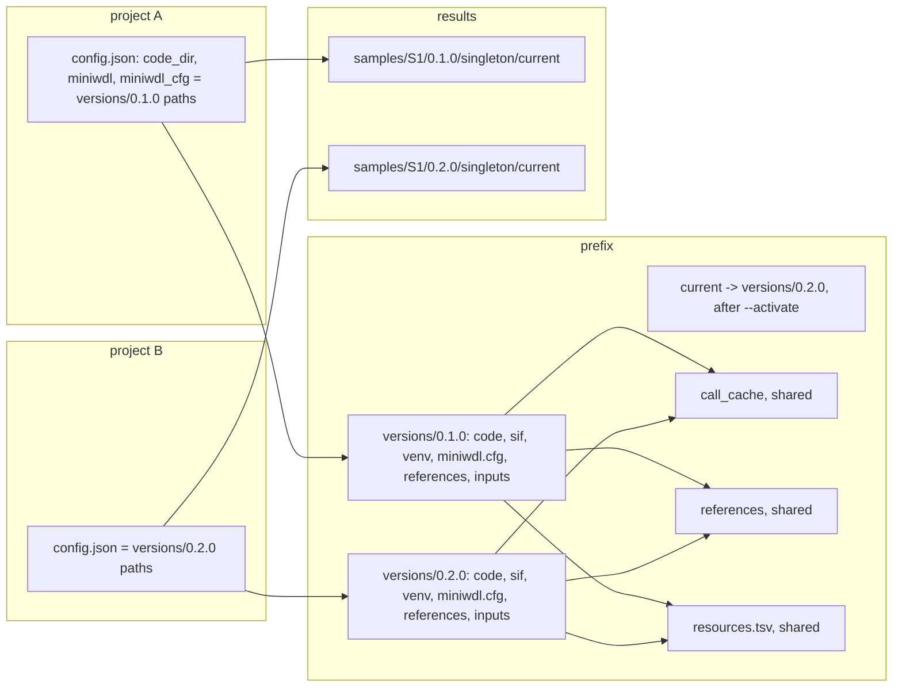

# Upgrading

## Versions side by side

A bundle installs into its own `versions/<v>/` with its own SIF cache,
engine and rendered configuration; `install-bundle.sh` never touches another
version, and every version's rendered config names the same
`<prefix>/resources.tsv`, so the resource policy carries over (a new
version's inventory may list new tasks: check `ugc-wgw resources` for rows that
no longer match). `--activate` only moves `current`. A project records the
resolved version directory it was initialised against, so an existing
project keeps running on its version after a newer one is activated.
Results paths carry
the version, so two versions never overwrite each other's attempts.

## Before upgrading

Stop every `ugc-wgw submit` of the project (Ctrl-C; the runs are cancelled and
retried later from the call cache). The first command of a newer driver on a
project migrates its state database forward and says so
(`migrated ... to schema N`); an older driver refuses a database migrated by
a newer one, so do not point an old install at a project that a new one has
touched.

## Moving a project to a new version

Either create a new project against the new install (chapter 05) and register
the same sample sheet and cohort list, or edit the four engine paths in
`.ugc-wgw/config.json` (`code_dir`, `miniwdl`, `miniwdl_cfg`, `venv_dir`) and
the three reference map paths to the new version's directories. The driver reads
`VERSION` from `code_dir` on every command, so after the edit every subject is
"not done" at the new version and `submit` starts from the first stage.

What actually re-runs is decided by miniwdl's call cache, not by the driver:
a task whose inputs, command and image digest are unchanged replays from the
cache in seconds. An upstream bump that changes an image digest re-runs every
task using that image and everything downstream of it. The changelog names
what changed in each release.

## Re-using older results

`--any-version` on `submit` accepts an earlier stage's success at any version
as a prerequisite and reads its outputs. Use it to run `cohort_merge` at
version 0.2.0 over `singleton` results produced at 0.1.0 without re-running
the samples, or to `downstream` old `upstream` results after a phasing-only
change. The run manifest records, per member, the version and run ID whose
outputs were used, so the mixture is traceable. Do not use it across an
upstream change that alters the earlier stage's outputs in a way the later
stage cares about; the changelog says when that is the case.

## When to re-initialise instead

- The new bundle changes `config.json`'s schema (the driver refuses to load
  and says so).
- The reference data changed (`references.lock` in the changelog): the
  installer copies the new tree under `<prefix>/references/` next to the old
  one, and a new project's `--ref-map` points at the new rendered map; old
  projects keep the old map. Results made against different builds (0.1.0 on
  GRCh38, 0.2.0 on GRCh38_GIABv3) must not be mixed with `--any-version`.
- You want a clean state database for a new campaign.

## SIF cache and storage

Each version carries its own `sif/` (about 26 GB with every image). Unchanged
images are duplicated between versions; remove `versions/<old>/` when no
project references it any more (`grep -l versions/<old> */.ugc-wgw/config.json`
across your projects) and its results have their manifests. The call cache
grows with every distinct task execution; it is safe to delete entries, at
the price of recomputation. Successful runs' work directories are already
reclaimed by `delete_work = success`; failed attempts keep theirs until you
remove the attempt directory by hand, which the driver never does.
