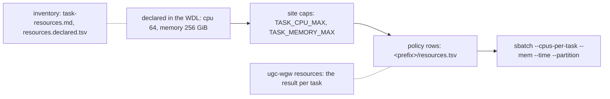

# 12 Task resources

What every task asks SLURM for, how to fit those requests to the cluster
without editing WDL, and how to check what was actually asked.

## Why this exists

Every upstream task hard-codes its cores and memory as private WDL
declarations: `pbmm2_align_wgs` asks for 32 cores and 128 GB,
`deepvariant_call_variants_cpu` for 64 cores and 256 GB, whatever the
cluster looks like. No inputs file can reach those numbers, and a partition
whose nodes have 48 cores refuses the DeepVariant job outright:

```
sbatch: error: CPU count per node can not be satisfied
sbatch: error: Batch job submission failed: Requested node configuration is not available
```

The driver classifies that as a `resource` failure (chapter 09). The fix
belongs to the site, in two layers that sit between the WDL and `sbatch`.

## The three layers



Text version: the WDL declares a request; miniwdl rounds it down to the
site caps; the `ugc_wgw_resources` plugin then applies the policy rows for that
task; miniwdl-slurm turns the result into the `sbatch` arguments. The
inventory documents the first box; `ugc-wgw resources` prints the last.

1. **Declared.** What the task's `runtime` block says. The generated
   [inventory](task-resources.md) lists it for every task the six
   entrypoints can call, with the expression when the value depends on the
   inputs (the N-scaled cohort memory) and a note when the task's command
   uses the same declaration.
2. **Site caps.** `TASK_CPU_MAX` and `TASK_MEMORY_MAX` in the site file
   (chapter 04) become miniwdl's `cpu_max` and `memory_max`: a larger
   request is rounded down, once, for every task, and miniwdl logs
   `runtime.cpu adjusted to host limit`. Set them to the node shape of the
   partition and nothing asks for more than a node has. On a cluster of
   48-core, 384000 MB nodes: `TASK_CPU_MAX=48`, `TASK_MEMORY_MAX=375G`.
3. **Policy rows.** `<prefix>/resources.tsv` names tasks (or globs) and the
   cores, memory, wall time, partition or constraint they should get
   instead. The `ugc_wgw_resources` miniwdl plugin, shipped in every bundle,
   applies the matching rows to each task after the caps and before the
   job is submitted. This is how hifiasm gets the large-memory partition
   and how a task that keeps dying gets a longer wall time.

Cohort tasks have a fourth option that comes first: their memory is a
workflow input (`glnexus_mem_gb`, `svx_mem_gb`, ... in chapter 08), set per
project under `stage_inputs` (chapter 05). Prefer it for them, because the
value also sizes the tool's own budget (`glnexus --mem-gbytes`); a policy
row changes only what SLURM allocates.

## The policy file

Tab-separated, header required, `#` lines ignored. The installer creates
`<prefix>/resources.tsv` from `backends/hpc/resources.tsv.example` when it
does not exist and never overwrites it; edit it in place and the next task
to start reads it (every task launch re-reads the file when it changed).

```
task	cpu	memory	time	partition	constraint
deepvariant_call_variants_cpu	48	-	-	-	-
ugc_wgw_hifiasm_assemble	-	-	2-00:00:00	fat	-
glnexus	-	200G	-	-	-
deepvariant_*	-	-	12:00:00	-	-
```

| Column | Meaning |
|---|---|
| `task` | A task name from the inventory, or a glob (`deepvariant_*`). |
| `cpu` | Cores (`--cpus-per-task`). |
| `memory` | With a unit; units are binary whatever the spelling (`256G`, `256GB` and `256GiB` all mean 256 GiB, the way the WDL declares and `--mem` counts). `1.5T` and `512M` work too. |
| `time` | `sbatch` syntax: minutes, `MM:SS`, `HH:MM:SS`, `D-HH`, `D-HH:MM` or `D-HH:MM:SS`; rounded up to whole minutes. |
| `partition` | `--partition` for this task. Needs `SLURM_PARTITION` in the site file, see below. |
| `constraint` | `--constraint` (a node feature such as `mem384GB`). |

A cell that is `-` or empty keeps what the task declared (after the caps).
Every row whose pattern matches a task applies, in file order, and a later
row's cells override an earlier row's: put a `*` or `deepvariant_*` row
first and the exceptions after it. Extra columns named `stages`, `source`
and `notes` are ignored, so rows of the inventory file
(`<prefix>/versions/<v>/code/backends/hpc/resources.declared.tsv`) can be
copied as they are and the cells edited.

A row's values are final: they are not capped by `TASK_CPU_MAX` or
`TASK_MEMORY_MAX`, so a row can send a 300 GB task to a fat partition. A
malformed file is refused by `ugc-wgw submit`, `ugc-wgw retry` and `ugc-wgw
resources` with the file and line before anything is launched; the installer
checks it too.

## What a row does and does not change

A row changes the SLURM allocation. The command inside the task is what
the WDL wrote:

- Lowering `cpu` below the declared value leaves `--threads ~{threads}` at
  the declared count: the tool oversubscribes its cores, which is slower
  but correct. The inventory marks these tasks `command uses threads`.
  DeepVariant's `call_variants` does not interpolate its thread count, so
  capping it to 48 costs nothing.
- Lowering `memory` below what a tool budgets for itself
  (`glnexus --mem-gbytes`, paftools' `sort -S`; marked `command uses mem`)
  can get the task killed. Raise those through `stage_inputs` instead.
- Raising `cpu` or `memory` gives the tool room it may not use.
- `time` replaces the site default `TASK_TIME_MINUTES` for that task.

## Partitions

`sbatch` keeps the last `--partition` it sees, and miniwdl-slurm appends
`[slurm] extra_args` after the per-task arguments. A partition in
`SLURM_EXTRA_ARGS` would therefore win over every row. Name the default
partition and account in `SLURM_PARTITION` and `SLURM_ACCOUNT` instead
(chapter 04); they become runtime defaults that a row can override. The
installer refuses a site file that keeps `--partition` or `--account` in
`SLURM_EXTRA_ARGS` next to those keys, and `ugc-wgw resources` warns when the
rendered config still has both.

With that in place, assembly beside variant calling needs no second
`miniwdl.cfg` (chapter 03): one row, `ugc_wgw_hifiasm_assemble` with
`partition` `fat`, sends hifiasm to the large-memory nodes in every project
that uses this install. A partition may allocate whole nodes whatever the
row asks: on the smoke cluster the `fat` partition gave hifiasm 96 cores
for a 48-core row.

## GPU tasks

Two tasks ask for GPUs, both alternatives to CPU DeepVariant in `singleton`
and `upstream`: `deepvariant_call_variants_gpu` (the `call_variants` step
on one GPU, 8 cores, 44 GiB; `make_examples` and `postprocess_variants`
stay on CPUs) and `run_parabricks_deepvariant` (NVIDIA Parabricks doing
all three steps on four GPUs, 48 cores, 192 GiB; needs 16 GB or more per
GPU). Which of them runs is one project switch, not a stage input:

```bash
ugc-wgw init ... --deepvariant gpu --gpu-type a100          # or: parabricks [--parabricks-gpus 4]
```

`config.json` keeps it as `deepvariant`, `gpu_type` and `parabricks_gpus`,
and the driver fills `use_gpu`, `use_parabricks_deepvariant`, `gpuType`
and Parabricks' GPU count (a call-qualified input the WDL does not expose
otherwise) for both stages; `stage_inputs` can still override any of
them. Two things in the install carry the request to SLURM:

1. **The gres.** miniwdl-slurm turns the task's `gpuCount` and `gpuType`
   into `sbatch --gres gpu:<type>:N`, `gpu:N` when the type is empty. The
   type must be one of the partition's (`sinfo -o "%P %G"` prints
   `gpu:a100:4`). Upstream's HPC backend fills an unset type with `""`,
   which would render as `gpu::N`; the `ugc_wgw_resources` plugin drops it.
2. **The partition and `--nv`.** GPU jobs need the GPU partition:
   `SLURM_PARTITION_GPU` in the site file (chapter 04) becomes
   `slurm_partition_gpu`, which miniwdl-slurm uses for every task with a
   `gpuCount`; a policy row with a `partition` for the task overrides it
   (the plugin writes the row's value to both keys). Apptainer must bind
   the node's driver into the container: `SINGULARITY_NV=1` appends `--nv`
   to `[singularity] run_options`. Neither is set on a cluster without
   GPUs, which is the default.

`ugc-wgw resources` shows the outcome in the `gpus` column (`a100:1`,
`a100:4`) and the partition, names the flavour in its summary line, and
warns when `--nv` or the GPU partition is missing; `submit` prints the
same line. Under miniwdl-slurm (the backend that reads `gpuCount`) each
GPU task logs a `ugc-wgw gpu request` NOTICE with its gres in `workflow.log`,
and `tests/smoke/run.sh sacct` lists the allocated gres per job. The local
smoke (two consumer GPUs, plain Singularity backend, one run in flight
because every task there sees every GPU) exercises the `gpu` flavour; the
cluster comparison of all three follows.

Measured on the smoke cluster (chr20 data, 2026-09-23): GPU DeepVariant
gives the same calls as the CPU flavour within a few records and saves no
wall time there, because `call_variants` takes minutes on either and
`make_examples` runs on CPUs in both; it pays off only where the
`call_variants` step itself is the bottleneck. Parabricks finishes a sample
2.7 times sooner (its one task replaces the three DeepVariant steps) but
is a different build of the caller: 7 percent fewer small variants, mostly
hom-alt and indels, and a higher Ts/Tv on the same BAM. Treat it as a
flavour to validate against a truth set for your data before production
use, not as a drop-in accelerator.

## Checking what will be asked

```bash
ugc-wgw resources                      # every task: declared, caps, rows, result
ugc-wgw resources --changed            # only the tasks a cap or a row changes
ugc-wgw resources --stage assembly     # one stage
ugc-wgw resources --json
```

```
# resources: cpu_max=48 memory_max=375G policy=/proj/ugc/resources.tsv (2 rows) deepvariant=cpu
task                           stages              declared    cpu         memory  time                 partition     ...
deepvariant_call_variants_cpu  singleton,upstream  64 / 28G    48 (clamp)  28G     3-00:00:00           core
ugc_wgw_hifiasm_assemble           assembly            48 / 288G   48          288G    2-00:00:00 (policy)  fat (policy)
```

`(clamp)` marks a site cap, `(policy)` a row; the `rules` column names the
rows that applied. The same summary line is printed by `submit --dry-run`
and logged when `submit` starts. `ugc-wgw resources` also warns about rows that
match no task (a typo), a policy file the config names but that does not
exist, and an install whose engine has no `ugc_wgw_resources` plugin.

After a run, the evidence is in three places: the task's
`slurm_singularity.log.txt` has the `sbatch` line; `workflow.log` has one
NOTICE per changed task (`ugc-wgw resource policy applied` with
`cpu 64→48, partition -→fat`) and one WARNING per capped task; `ugc-wgw report`
tabulates both under "Resource adjustments", and `run_manifest.json`
records the policy file's path and sha256 (`resource_policy`). On the HPC,
`tests/smoke/run.sh sacct` shows the allocated cores and peak memory per
task against what was asked.

Two details worth knowing. A run whose every task comes from the call cache
never starts the plugin, and miniwdl then prints a harmless
"unused configuration" warning for `[ugc_wgw] resources`. Running `miniwdl run`
by hand applies the caps and the policy only with `--cfg` pointing at the
rendered `miniwdl.cfg`.

## Finding the right numbers

The inventory gives the declared values; the cluster gives the truth.
`tests/smoke/run.sh sacct` shows peak memory and elapsed time per task, and
so does `sacct` on the job ids a manifest records:

```bash
sacct -j <id> --format JobID,AllocCPUS,ReqMem,MaxRSS,Elapsed,Timelimit
```

A task whose peak memory sits far below its request can take a smaller
row, which lets more jobs run at once; one that ends near its limit needs a
larger one. A command that turns finished runs' accounting into proposed
rows is planned once the HPC smoke test has produced real numbers.
