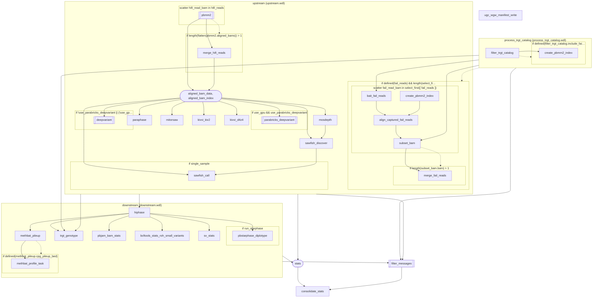
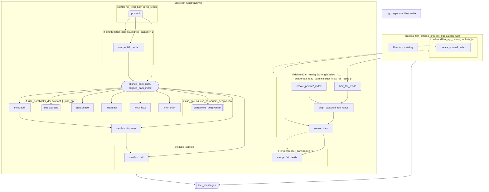
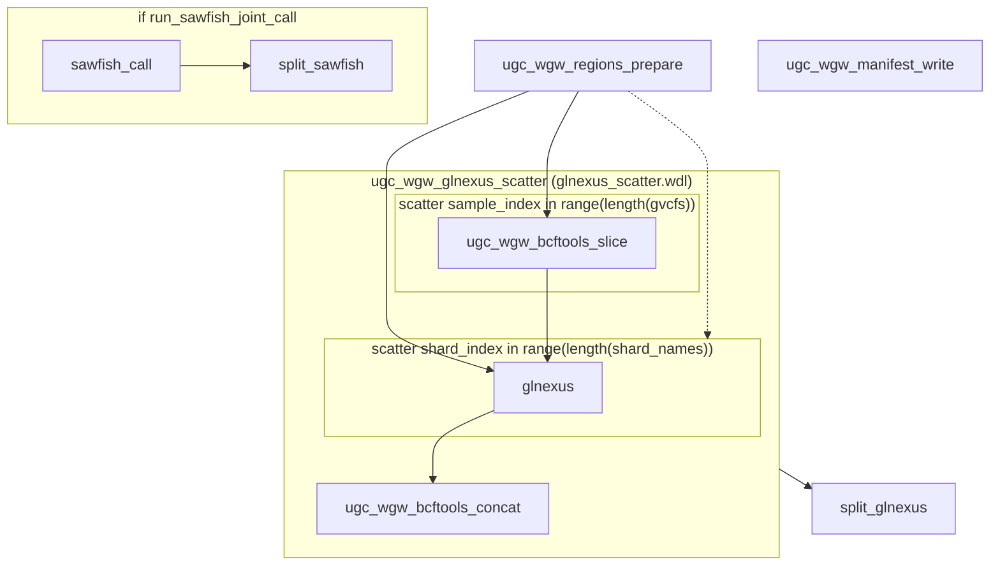
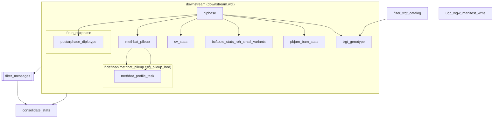
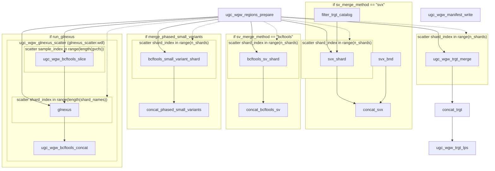
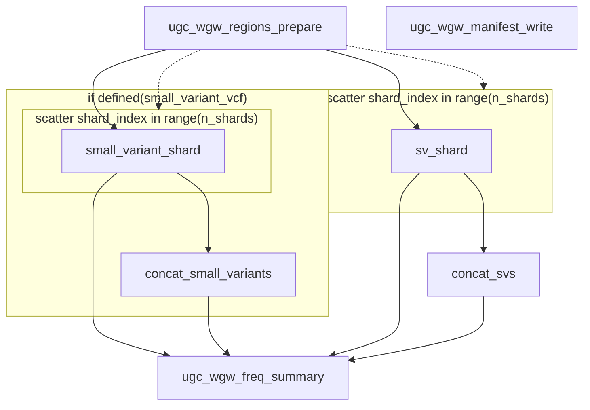
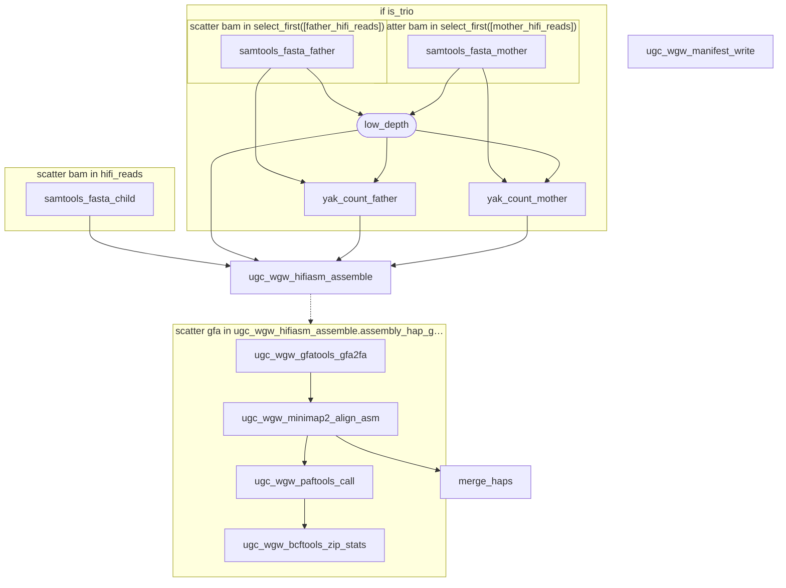

<!-- Generated by scripts/wdl-graph.py from workflows/ugc_wgw_*.wdl; do not edit.
     Regenerate: python3 scripts/wdl-graph.py --write (tests/check.sh fails on drift). -->

# Workflow call graphs

Exact call graphs of the seven entrypoints, rendered from the miniwdl AST by
`scripts/wdl-graph.py`. A workflow called directly by an entrypoint is inlined
as a box; a workflow it calls in turn is one node. Simplified diagrams with
the switches and resources explained are in `08-stages.md`.

Legend:

- `["name"]` is a task call. The name is the call name, which is also the
  `call-<name>` directory under the run's miniwdl work directory.
- `[["name"]]` is a call of a workflow that is not expanded in this diagram.
- `(["a, b"])` is a declaration that joins several call outputs, for example
  `select_first` over an optional merge and a single input.
- Boxes are scatter sections (`scatter x in expr`), conditional sections
  (`if expr`) and inlined workflows (`call name (file.wdl)`).
- A solid arrow means an output of the source feeds an input of the target.
  A dashed arrow means the source feeds the expression that controls a box.
- Workflow inputs and outputs, plain declarations and the
  `backend_configuration` call are not drawn.

## ugc_wgw_singleton

Source `workflows/ugc_wgw_singleton.wdl`, depth 1, Mermaid source 2367 characters.

Inlined workflows:

- `process_trgt_catalog`: `vendor/hifi-human-wgs-wdl/workflows/process_trgt_catalog/process_trgt_catalog.wdl`
- `upstream`: `vendor/hifi-human-wgs-wdl/workflows/upstream/upstream.wdl`
- `downstream`: `vendor/hifi-human-wgs-wdl/workflows/downstream/downstream.wdl`

Workflow nodes (not expanded here):

- `pbmm2`: `vendor/hifi-human-wgs-wdl/workflows/wdl-common/wdl/workflows/pbmm2/pbmm2.wdl`
- `parabricks_deepvariant`: `vendor/hifi-human-wgs-wdl/workflows/wdl-common/wdl/workflows/parabricks/parabricks_deepvariant.wdl`
- `deepvariant`: `vendor/hifi-human-wgs-wdl/workflows/wdl-common/wdl/workflows/deepvariant/deepvariant.wdl`
- `filter_messages`: `vendor/hifi-human-wgs-wdl/workflows/wdl-common/wdl/workflows/filter_messages/filter_messages.wdl`

## ugc_wgw_upstream

Source `workflows/ugc_wgw_upstream.wdl`, depth 1, Mermaid source 1704 characters.

Inlined workflows:

- `process_trgt_catalog`: `vendor/hifi-human-wgs-wdl/workflows/process_trgt_catalog/process_trgt_catalog.wdl`
- `upstream`: `vendor/hifi-human-wgs-wdl/workflows/upstream/upstream.wdl`

Workflow nodes (not expanded here):

- `pbmm2`: `vendor/hifi-human-wgs-wdl/workflows/wdl-common/wdl/workflows/pbmm2/pbmm2.wdl`
- `parabricks_deepvariant`: `vendor/hifi-human-wgs-wdl/workflows/wdl-common/wdl/workflows/parabricks/parabricks_deepvariant.wdl`
- `deepvariant`: `vendor/hifi-human-wgs-wdl/workflows/wdl-common/wdl/workflows/deepvariant/deepvariant.wdl`
- `filter_messages`: `vendor/hifi-human-wgs-wdl/workflows/wdl-common/wdl/workflows/filter_messages/filter_messages.wdl`

## ugc_wgw_cohort_call

Source `workflows/ugc_wgw_cohort_call.wdl`, depth 1, Mermaid source 586 characters.

Inlined workflows:

- `ugc_wgw_glnexus_scatter`: `workflows/ugc_wgw/cohort/glnexus_scatter.wdl`

Workflow nodes (not expanded here): none.

## ugc_wgw_downstream

Source `workflows/ugc_wgw_downstream.wdl`, depth 1, Mermaid source 663 characters.

Inlined workflows:

- `downstream`: `vendor/hifi-human-wgs-wdl/workflows/downstream/downstream.wdl`

Workflow nodes (not expanded here):

- `filter_messages`: `vendor/hifi-human-wgs-wdl/workflows/wdl-common/wdl/workflows/filter_messages/filter_messages.wdl`

## ugc_wgw_cohort_merge

Source `workflows/ugc_wgw_cohort_merge.wdl`, depth 1, Mermaid source 1449 characters.

Inlined workflows:

- `ugc_wgw_glnexus_scatter`: `workflows/ugc_wgw/cohort/glnexus_scatter.wdl`

Workflow nodes (not expanded here): none.

## ugc_wgw_cohort_freq

Source `workflows/ugc_wgw_cohort_freq.wdl`, depth 1, Mermaid source 510 characters.

Inlined workflows: none.

Workflow nodes (not expanded here): none.

## ugc_wgw_assembly

Source `workflows/ugc_wgw_assembly.wdl`, depth 1, Mermaid source 914 characters.

Inlined workflows: none.

Workflow nodes (not expanded here): none.

